# СОДЕРЖАНИЕ

- [Введение](#введение)
- [1 Литературный обзор](#1-литературный-обзор)
- [2 Постановка задачи](#2-постановка-задачи)
- [3 Набор данных](#3-набор-данных)
- [4 Методы и модели](#4-методы-и-модели)
- [5 Эксперименты](#5-эксперименты)
- [6 Результаты](#6-результаты)
- [Заключение](#заключение)
- [Список использованных источников](#список-использованных-источников)
- [Приложения](#приложения)

---

## Введение

Современные образовательные организации активно используют электронные журналы, системы дистанционного обучения и репозитории учебных материалов. Эти решения хорошо работают с текстом, изначально созданным в цифровой форме, поскольку он допускает прямой поиск, версионирование и программную проверку. 

Иначе обстоит дело с материалами на бумажных носителях: после сканирования или фотографирования информация оказывается зафиксированной как изображение и требует распознавания, прежде чем станет частью цифрового контура.

Рукописный текст по-прежнему широко распространён: конспекты, черновики, экзаменационные работы, подписи к учебным материалам. Писать от руки удобно для быстрой фиксации формул и схем; в ряде административных процедур важна и подлинность выполненного действия. Человек узнаёт привычный почерк без специальной подготовки, а алгоритм должен устойчиво работать при разных стилях, инструментах и условиях съёмки. Распознавание текста по изображению и анализ почерка как набора признаков моторики формулируются по-разному, но оба опираются на растр и относятся к задачам компьютерного зрения и машинного обучения.

Техническая сложность рукописи связана с изменчивостью графем по форме штриха и связности, с наклоном, давлением, масштабом, исправлениями и смесью печатных вставок с рукописью. Качество съёмки добавляет шум, перспективу, неравномерный фон. Для глубоких моделей нужны предобработка и аугментации, аккуратное разбиение данных и метрики, которые отражают не только среднюю точность, но и типичные ошибки при перекосах классов.

Свёрточные и трансформерные архитектуры, а также последовательностные декодеры заметно улучшили качество по сравнению с эпохой ручных признаков. Итог всё равно зависит от воспроизводимости эксперимента, описания данных и протокола обучения, проверки на отложенной выборке и разбора ошибок на реальных примерах.

В работе рассматривается распознавание рукописного и смешанного текста в приложении к образовательным и архивным сценариям, где основной источник данных — изображение страницы или строки. Состав входов и выходов, целевая функция и метрики формализованы в разделе о постановке задачи.

Цель работы — спроектировать и реализовать воспроизводимый конвейер подготовки данных, обучения и оценки моделей глубокого обучения для выбранной постановки по рукописным изображениям и выполнить сопоставительный анализ нескольких архитектур в рамках единого протокола. Помимо численных показателей качества предполагается оформление кода и конфигураций так, чтобы ключевые прогоны обучения и проверки можно было воспроизвести по репозиторию проекта.

---

## 1 Литературный обзор

Обзор охватывает как классические конвейеры, опиравшиеся на сегментацию, описание контуров и скрытые модели Маркова или рекуррентные распознаватели последовательностей, так и современные сквозные модели глубокого обучения без явной ручной декомпозиции конвейера, построенные на свёрточных блоках, механизмах внимания и трансформерных архитектурах, включая связки кодер–декодер для строки и страницы. Отдельный акцент делается на условиях обучения и оценки, на влиянии разметки и доменного сдвига между наборами данных, на компромиссах между точностью, задержкой вывода модели и требованиями к объёму вычислений.

### 1.1 Основные подходы к решению задачи

Различим два семейства целей, которые в бытовой формулировке часто объединяют под общим заголовком анализа почерка. Первая группа задач относится к восстановлению лингвистического содержания: нужно получить последовательность символов, слов или предложений по изображению рукописной строки, страницы или отдельного элемента формы. Вторая группа связана с установлением свойств самого почерка или автора без полного расшифровывания текста либо помимо него: верификация, что два образца принадлежат одному писателю, идентификация среди множества зарегистрированных шаблонов, оценка стабильности признаков во времени. Эти постановки используют сходные низкоуровневые представления изображения, но различаются функциями потерь, метриками и правовым статусом данных. Обзор в §1.1–1.3 сфокусирован на распознавании содержания; методы метрического обучения и эмбеддингов почерка затрагиваются лишь там, где пересекаются с энкодерами строк.

По масштабу входа традиционно выделяют распознавание изолированных символов, слов при ограниченном или полном словаре, текстовых строк произвольной длины и целых страниц с задачами компоновки макета. Изолированный символ исторически был первым объектом формализации в связи с доступностью контролируемых сборников образцов и относительной простотой классификации при фиксированном положении знака на поле ввода. Однако при переходе к свободному почерку доля ошибок сегментации между соседними знаками делает автономную классификацию порядковых элементов недостаточной без точной локализации границ. Уровень слова допускает использование языковых ограничений и словарных баз, что повышает устойчивость при ограниченном лексиконе форм и экзаменационных бланков, но становится источником систематических ошибок подстановки при выходе за пределы словаря. Уровень строки стал доминирующим для документного рукописного текста латиницы и ряда других алфавитов благодаря развитию методов последовательностной транскрипции и ослаблению требования явной покадровой сегментации символов. Уровень страницы добавляет задачи обнаружения зон текста, учёта перекосов строк и межстрочных интервалов, что приближает решение к общей проблеме анализа макета документа и часто опирается на детекторы и сегментаторы полей до запуска модулей строкового распознавания.

Классический конвейер распознавания опирается на явную последовательность обработки изображения: предварительную бинаризацию или подавление фона, коррекцию геометрии страницы и строки, выделение связных компонент или построение траектории штриха, нормализацию высоты штриха и угла наклона. На полученном представлении извлекались признаки конструируемые вручную: статистические моменты распределения чернил по зонам, параметры описывающие изгибы контура, топологические инварианты, локальные ориентации градиента и производные по траектории пера в случаях регистрации динамики письма на специализированных планшетах. Классификация могла выполняться методами ближайших соседей с метрикой на искажённых строках времени, опорными векторами, случайными лесами и иными ансамблями на табличных признаках. Для последовательностей знаков широкое распространение получили скрытые марковские модели и смеси гауссовских состояний на выходах векторных квантователей признаков, что позволяло моделировать локальную изменчивость длительности фаз начертания символа без жёсткой привязки к фиксированному числу кадров на знак.

Указанная декомпозиция имела методологическое достоинство прозрачности и возможности локальной диагностики: ошибку можно было локализовать на этапе бинаризации, выделения базовой линии или классификации конкретного знака. Однако качество каждого шага ограничивало потолок всего конвейера, а расходящиеся условия регистрации в образовательной практике фотографиями смартфона резко расширяли пространство возмущений относительно сканированных монохромных архивов исследовательских баз. Перенастройка набора эвристик под новый домен оказывалась трудоёмкой и слабо масштабируемой.

Переход к обучению представлений нейросетевыми методами первоначально сохранял модульность: свёрточные карты признаков или рекуррентные блоки подставлялись на место ручных дескрипторов, сохраняя на верхнем уровне марковские модели и процедуры временного выравнивания. Такие гибриды в ходе первых исследований демонстрировали рост устойчивости к шуму фона за счёт иерархического охвата контекста локальными фильтрами. Дальнейший отказ от явной посимвольной сегментации привёл к постановкам последовательностного обучения без покадровой временной разметки символов: функционалы объединённой временной классификации опираются на суммирование по множеству допустимых монотонных соответствий между выходной временной последовательностью нейросети и строкой транскрипции.

На практике это выразилось в сочетании свёрточного извлечения признаков по двумерной развёртке изображения строки с одномерной рекуррентной моделью и указанным типом функции потерь, где допускаются сжимающие отображения между числом временных шагов сети и длиной транскрипции при сохранении порядка символов.

Развитие архитектур с многомерными рекуррентными связями позволило частично учитывать двумерную организацию чернил при сохранении последовательностной интерпретации выхода. Вычислительная сложность и трудности параллельного обучения ограничивали масштабирование таких решений на очень длинные строки и высокоразрешённые сканы. Поэтому последующая эволюция сместилась к более глубоким стопкам свёрток с остаточными связями и стратегиям пространственной подвыборки с последующей одномерной рекуррентностью либо полному отказу от рекуррентности в пользу свёрточных блоков большого охвата и механизмов самосопоставления и обусловленной порождения символов.

Режим декодирования с использованием механизма внимания между представлениями строки и последовательностью символов перенёс на почерк практики нейромашинного перевода и распознавания устной речи в упрощённом виде: энкодер формирует упорядоченное поле признаков вдоль основной оси строки, декодер авторегрессионно порождает выходную последовательность, а матрица сопоставления позволяет модели выбирать нелокальные зависимости между фрагментами начертания и очередным символом или подсловной единицей. Такая схема естественно поддерживает переменную длину выхода и лексические ограничения через добавление языковой модели на уровне слияния вероятностей или через обучение с дополнительными потерями на текстовой последовательности.

Рост интереса к трансформерным архитектурам привёл к появлению моделей почеркового распознавания и смежных задач оптического распознавания, где блоки самосопоставления заменяют или дополняют рекуррентность на этапе кодирования изображения нормализованной строки или патча страницы. Предобучение на больших корпусах печатного текста с последующей дообучающей адаптацией на рукописных данных позволяет переносить лингвистические и визуальные привычки представления знаков при ограниченном объёме размеченного почерка. Альтернативная линия использует исключительно рукописные или смешанные наборы на всех этапах обучения при наличии достаточной инфраструктуры данных и вычислений.

Задачи страничного масштаба в образовательной предметной области обычно разбиваются на обнаружение прямоугольников текста или произвольных четырёхугольников строки современными детекторами, затем на исправление перспективы локальных фрагментов и последовательное или параллельное строковое распознавание. При высокой плотности пометок и зачёркиваниях качество детекции становится фактором сравнимым по значимости с качеством транскрибатора строки; поэтому интегральные модели, объединяющие выделение зоны и распознавание в одном обучающем контуре, представляют отдельное направление исследований с повышенными требованиями к данным.

Поддержка качества при недостатке разнообразных реальных образцов частично компенсируется синтетической генерацией изображений строк по имеющимся текстовым корпусам и моделям начертания и дрожания пера, стилизации под конкретные шрифтоподобные параметры почерка или смешиванию реальных фонов с синтетическими чернилами. Такие методы расширяют охват условных распределений фона и контраста, но несут риск доменного зазора между синтетическим и живым почерком, что проявляется в ошибках на редких биграммах и специфических связках букв в языках с развитой графической связностью написания.

Использование языковых моделей либо ограниченного словаря при декодировании изменяет спектр ошибок в сторону семантически правдоподобных подстановок при цене провала на редких именах собственных и неформализованных обозначениях в математических и химических записях, типичных для учебных работ. Поэтому компромисс между открытым словарём и ограничением по словарю является содержательным параметром постановки в образовательной доменной области и должен явно отражаться в метриках оценки и составе тестовых подвыборок.

Для задач анализа почерка без полной транскрипции распространены метрические схемы обучения эмбеддингов изображений строк или фрагментов с функциями контрастных потерь на уровне траектории признаков; архитектурно они часто совпадают с первыми стадиями распознавателей содержания и тем самым задают возможность трансфера между задачами при аккуратном соблюдении требований к предобработке персональных данных. Для образовательной эксплуатации это актуализирует вопросы информированного согласия и минимизации хранения биометрически значимых признаков.

Суммируя, основные подходы образуют исторически последовательную, но частично параллельно сосуществующую линию от явного посимвольного конвейера к сквозным нейросетевым транскрибаторам строк с функциями потерь полной временной разметки или механизмами внимания и трансформерными кодировщиками, дополняемым инструментами детекции на странице, синтетическим расширением данных и языковым постобработчиком. Выбор конкретной точки на этом спектре для практической реализации определяется доступностью размеченных данных по выбранному языку и стилю почерка, ограничениями на вычислительный бюджет в серверной или периферийной среде и требованиями к задержке при пакетной обработке экзаменационных пакетов или интерактивных сценариев.

### 1.2 Критический анализ существующих решений

В прикладной литературе одна и та же архитектурная схема может сопровождаться несопоставимыми протоколами предобработки, различным объёмом внешних языковых моделей и разной степенью утечки доменной информации из теста в настройку гиперпараметров; сопоставление по семействам методологий снижает риск прямого переноса численных выводов между несогласованными протоколами.

Классические конвейеры с явной сегментацией и ручными признаками сохраняют конкурентоспособность в узких постановках с контролируемой геометрией строки и предсказуемым контрастом чернил и фона, что приближает условия к задачам промышленного контроля качества печатных форм. В таких режимах диагностируемость ошибок и возможность локальной подправки эвристик окупают затраты на сопровождение. Однако при переходе к мобильной фиксации страниц или к историческим документам с нестабильной структурой бумаги и неоднородным фоном модульная схема демонстрирует хрупкость: ошибка раннего этапа не всегда компенсируется гибкостью классификатора на изолированном знаке, а адаптация к новому домену требует повторной инженерии сегментации, что слабо сочетается с масштабированием сервиса на тысячи пользователей и сотни форматов носителей.

Гибридные решения, где свёрточные или рекуррентные блоки заменяют ручные дескрипторы, но сохраняют на уровне последовательности марковскую модель или схему динамического программирования, обычно улучшают устойчивость к локальным дефектам изображения за счёт иерархического контекста. При этом методологически они часто продолжают предполагать относительно стабильное выравнивание строки и не снимают полностью проблему потолка качества, определяемого сегментацией или грубой нормализацией наклона. В сравнительных отчётах подобные работы иногда недоучитывают стоимость предобработки при измерении задержки вывода модели, что приводит к завышению привлекательности метода для интерактивных приложений.

Сквозные строковые модели на основе объединённой временной классификации задали практический стандарт для относительно длинных строк без посимвольной временной разметки. Их сильная сторона заключается в устранении явного разрезания знаков и в сравнительно прозрачной целевой функции, допускающей эффективное пакетное обучение. Слабое место проявляется в длинных зависимостях и в чувствительности к вертикальному и горизонтальному масштабированию строки без осторожной нормализации: рекуррентные тракты усиливают влияние искажений, если энкодер недостаточно инвариантен. В части воспроизводимости литературы обнаруживается разброс из-за различий в нормализации изображения, в использовании или неиспользовании внешнего языкового моделирования и в несогласованных протоколах разделения авторов между обучением и тестом на коллекциях реального почерка.

Схемы с механизмом внимания и авторегрессионным декодером расширяют класс ошибок по сравнению с монотонными выравниваниями и лучше переносят сложные переписывания и нелинейные соответствия между пиксельной траекторией и лексической единицей, что важно для языков с богатой орфографией и для рукописей с частыми вставками и исправлениями. Цена подхода заключается в повышенной чувствительности к качеству инициализации, в более тяжёлом декодировании и в риске галлюцинаций при нехватке регуляризации или при несогласованности распределения текстов обучения и эксплуатации. Сопоставление с CTC-моделями в публикациях нередко выполняется при несимметричном бюджете на подбор декодера и языковой модели, что затрудняет перенос количественных выводов на производственный контур без повторной верификации.

Трансформерные кодировщики изображений строк и патчей страниц открывают путь к предобучению на масштабных корпусах печатного текста и последующей адаптации на ограниченных почерковых наборах, что особенно заметно в задачах, близких к историческому наследию и архивации. Однако выигрыш от предобучения не является автоматическим: доменный разрыв между печатью и почерком может сохраняться для языков и периодов, где морфология начертания систематически отличается от типографских прототипов. Вычислительные и память-требования трансформеров ограничивают разрешение строки и размер батча на периферийных устройствах; для образовательных систем массового применения это ставит вопрос о разделении контура на серверную тяжёлую модель и лёгкий предварительный фильтр качества изображения.

Методы синтетического расширения обучающей выборки и методы переноса стилей почерка позволяют частично компенсировать дефицит разнообразных реальных трасс. Их критический разбор показывает, что синтетика усиливает устойчивость к фону и освещению сильнее, чем к набору связных лигатур и межбуквенных переходов в живом почерке; в результате модели переоценивают качество на валидации, построенной по смешанному распределению, и дают систематические ошибки на редких сочетаниях символов в учебных работах естественных наук. Отчётливое описание состава синтетики является необходимым условием честного сравнения между работами, но на практике указывается не всегда.

Использование лексиконов и языковых моделей при постдекодировании почти всегда улучшает показатели на доменах с ограниченной лексикой, но меняет профиль ошибок: снижается доля случайных замен при росте подмен соседних слов и при деградации на именах собственных, формулах и номерах, критичных для проверочных материалов. В критическом обзоре это означает, что сопоставление архитектур без унификации постлингвистического контура некорректно интерпретируется как сопоставление зрительных модулей.

Практики цифровизации исторических источников и недавние проекты распознавания автографов демонстрируют, что прикладной успех определяется не только точностью символьной транскрипции, но и согласованностью конвейера с архивной политикой, с требованиями к разметке неопределённостей и с участием эксперта в контуре обратной связи. Отсутствие фиксации этих элементов в описании модели машинного обучения делает литературные цифры плохо сопоставимыми с ожиданиями образовательных или музейных заказчиков, для которых полнота и проверяемость цепочки от скана до публикации сопоставима по важности с относительным снижением ошибки на процент пунктов.

| Семейство подходов | Типичный вклад в качество при ограниченных данных | Устойчивость к шумной регистрации и доменному сдвигу | Прозрачность ошибок и сопровождаемость | Вычислительная нагрузка обучения и вывода модели | Риск некорректных литературных сравнений |
|-------------------|---------------------------------------------------|------------------------------------------------------|----------------------------------------|---------------------------------------------|-----------------------------------------|
| Явный классический конвейер с ручными признаками | умеренный без больших массивов разметки | низкая без глубокой адаптации эвристик | высокая по модульности | обычно умеренная | средний при фиксации конвейера целиком |
| Гибрид нейросетевых признаков и марковских моделей на последовательности | заметный относительно чисто классических признаков | средняя | средняя | умеренная до высокой | высокий при различии предобработки |
| CNN+RNN+CTC для строки | высокий при достаточном охвате стилей в обучении | средняя при аккуратной нормализации | средняя | обучение — среднее; вывод модели — как правило низкая задержка | высокий из‑за различий языковых моделей и нормализации |
| Энкодер–декодер с вниманием | высокий при больших данных и аккуратной регуляризации | средняя; выше при сложной морфологике знака | ниже из‑за авторегрессии и возможных галлюцинаций | обучение — высокое; вывод модели — выше за счёт декодирования | высокий при несимметричном постобработчике |
| Трансформерный кодировщик и сквозная адаптация | высокий потенциал при успешном предобучении | средняя; переносимость между печатью и почерком не гарантирована | ниже для неспециалиста | обычно высокая | высокий при различии предобучения и размера входа |

В совокупности критический анализ подчёркивает, что доминирующие публикационные метрики отражают лишь один срез системы распознавания рукописного текста и что содержательное сравнение решений должно включать условия данных, протокол декодирования и операционные ограничения, которые для образовательных и историко-архивных приложений часто оказываются определяющими при выборе архитектуры.

### 1.3 Ограничения существующих подходов

Ограничения ниже понимаются не как временная техническая недоработка конкретной реализации, а как системные границы, которые сохраняются при переходе от классических конвейеров к современным сквозным моделям и которые должны быть явно учтены при постановке эксперимента и интерпретации метрик в образовательных и архивных сценариях.

Во-первых, почерк как объект наблюдения задаёт принципиальную частичную наблюдаемость процесса генерации знаков: стороннему наблюдателю доступно лишь статическое распределение чернил по носителю, без непрерывной временной разметки траектории на уровне символов. Различные траектории письма могут давать близкие визуальные результаты, из-за чего модели по статическому изображению опираются на менее информативный вход, чем онлайновые траектории пера или сигнал электронного планшета. Это ограничивает класс методов, которые можно непосредственно переносить и честно сравнивать между офлайновым изображением и онлайновым каналом.

Во-вторых, объём и состав данных остаются главным узким местом: исторические собрания почерка редко сочетают масштаб с юридической и методической готовностью к открытому переиспользованию, а распространённые современные корпуса преимущественно отражают узкий спектр языков и стилей. Связная кириллическая экзаменационная практика с формульными вставками и смешением печатных и рукописных фрагментов слабо покрыта универсальными наборами; доля редких буквенных сочетаний и специализированных токенов в учебных текстах высока по сравнению с типичными новостными корпусами. Поэтому улучшение символьной ошибки при ограниченном словаре или на однородном домене легко переоценивается как показатель пригодности к реальному потоку входных данных.

В-третьих, эталонная разметка и сопровождающие метаданные вносят неустранимый шум: транскрипции зависят от соглашений по орфографии, пунктуации и пробелам; в исторических материалах неизбежны неоднозначности прочтения. Повторная разметка разными экспертами смещает распределение целевой переменной, а типичное обучение с жёсткой меткой редко учитывает неопределённость этикетки явным образом.

В-четвёртых, доменный сдвиг между условиями обучения и эксплуатации проявляется не только в шуме сенсора и текстуре фона, но и в геометрии макета: экзаменационные бланки, конспекты в линованных тетрадях и фотографии досок задают различные перспективные искажения и профили освещения. Унифицированная нормализация строки переносится между типами носителей не автоматически; устойчивая адаптация требует либо дорогостоящих парных данных между доменами, либо опоры на синтетику с известными ограничениями реализма.

Синтетическое расширение выборки сталкивается с тем, что распределение живых почерковых стилей высокоразмерно и слабо аппроксимируется параметрическими моделями дрожания и сглаживания штриха. Верхняя граница обобщения на редкие лигатуры и индивидуальные привычки соединения букв остаётся ограниченной даже при визуально правдоподобных синтетических примерах.

Использование лексикона и языковой модели при декодировании переносит ограничение в содержательную область: модель становится смещённой к высокочастотным конструкциям и может систематически ухудшать восстановление идентификаторов, номеров, формул и собственных имён — класса элементов, критичного для проверки учебных работ. Рост метрик при подключении внешней языковой модели поэтому не эквивалентен улучшению предметной полезности без отдельной оценки на стратах редких и специализированных токенов.

Вычислительные ограничения проявляются на этапах обучения и применения: обучение глубоких трансформерных и внимательных архитектур требует графических ускорителей и объёма памяти; вывод модели на периферии или при пакетной обработке крупных архивов ограничен задержкой и пропускной способностью. Это накладывает верхнюю границу на разрешение входа, длину контекста и возможность ансамблирования, даже если в лабораторной среде достигнут высокий балл по отчётным таблицам.

Ограничения конфиденциальности и правового режима актуальны, когда признаки почерка используются в задачах, близких к биометрической идентификации, или когда для обучения требуется длительное хранение персональных работ. Накопление эмбеддингов строк повышает риски утечки чувствительных шаблонов; принцип минимизации данных конфликтует с желанием расширить выборку реальными трассами и тем самым добавляет организационный потолок поверх чисто алгоритмического.

Страничный контур усиливает проблему каскада ошибок: ошибка детекции зоны или неверное перспективное выравнивание строки необратимо искажает вход строкового распознавателя, а в сводной статистике это может проявляться как сбой языкового постпроцессора или как низкая уверенность зрительного модуля. Без раздельной отчётности по этапам диагностика затруднена, тогда как во многих публикациях измеряется только конечная символьная метрика.

Наконец, распространённые метрики сравнения с единственной эталонной транскрипцией отражают лишь один аспект качества и слабо связаны с полезностью для поиска по архиву, индексации исторических комплексов или полуавтоматической верификации ответов, где важны стабильность идентификаторов документов, учёт альтернативных прочтений и возможность экспертной правки без разрушения всего контура машинного распознавания. Здесь ограничение скорее методологическое: согласование числовых показателей модели с содержательными критериями гуманитарного или педагогического контроля не сводится к улучшению одного нейросетевого блока.

### 1.4 Обоснование новизны предлагаемого подхода

Инженерный вклад работы — не новая архитектура «с нуля», а согласованное описание контура для архивных страниц со слабой регулярностью макета и деградацией носителя: оценка качества изображения, ветвящаяся предобработка, детекция зон, строковый распознаватель и раздельный учёт метрик по этапам. Отдельная нейросетевая новизна не заявляется.

Количественная оценка в программной части на текущем этапе ограничена подзадачей распознавания вырезков строк по bbox из COCO набора YeniseiGovReports-TD (`coco_lines`). Обучаемый детектор страницы, переключение ветвей ψ по карте качества и слияние гипотез полос в зарегистрированных прогонах не задействованы. Приведённая выше полностраничная схема и описание целевого контура задают ориентир для развития репозитория и сопоставимости с литературой, а не полный перечень уже полученных отчётных метрик.

Типичный архивный случай характеризуется совместным действием нескольких факторов: неизвестной или частично утраченной иерархии блоков текста, наклоном и кривизной строк без эталонной сетки, краевыми обрезаниями, неравномерной засветкой, просвечиванием текста с оборота, пятнами и локальными потерями контраста, а также различием масштабов записи в пределах одной страницы. В такой постановке жёсткая последовательность бинаризация выделение строки нормализация высоты часто приводит к накоплению ошибок на ранних стадиях. Предлагаемый подход отталкивается от идеи адаптивного контура: перед строковым или блоковым распознавателем вводится оценка локального качества и класса деградации по патчам страницы, после чего применяется одна из ветвей предобработки с ограниченной физической интерпретируемостью, например подавление фона с сохранением штриха, компенсация медленно меняющейся засветки, лёгкое выравнивание локальной геометрии без жёсткого глобального преобразования всего листа. Выбор ветви может задаваться эвристически по порогам контраста и оценке шума либо обучаться вспомогательным классификатором на слабо размеченных примерах; существенно, что это явно фиксируется в протоколе эксперимента и воспроизводится по конфигурации.

На уровне структуры страницы предлагается ослабить требование заранее известного шаблона полей и опираться на каскад предложений зон текста с последующей фильтрацией по геометрическим и текстовым признакам уверенности. Для обнаружения прямоугольных или произвольно ориентированных строк допускается использование современных детекторов, устойчивых к умеренным поворотам и фрагментации, с последующим вырезанием четырёхугольников и локальной перспективной коррекцией к эталонной полосе строки. Если структура не восстанавливается надёжно, допускается режим скользящего окна или разбиение страницы на перекрывающиеся полосы с подавлением дубликатов на этапе слияния гипотез распознавания. Таким образом неполная или изменённая структура трактуется не как ошибка входа, а как штатный режим, для которого определены запасные стратегии сегментации.

На уровне распознавания содержания предлагается использовать сквозные модели строкового типа из семейств, обсуждавшихся выше, с двумя дополнительными элементами, имеющими отношение к архивным материалам. Во-первых, обучение и аугментация явно включают классы искажений, имитирующих потертость, локальную потерю чернил и дрожание скана, чтобы сместить распределение обучения ближе к наблюдаемому в архивах без завышенной опоры на идеализированные постановки лабораторных корпусов. Во-вторых, на этапе верификации вводится учёт неопределённости: сохранение альтернативных гипотез декодирования или порог отсечения по уверенности для передачи фрагмента эксперту соответствует практике индексирования исторических источников, где полная автоматизация редко достижима и ценность системы определяется снижением трудозатрат при сохранении контроля качества.

Сопоставление с существующими работами опирается не на одиночную метрику символьной ошибки, а на протокол, который разделяет вклад предобработки, детекции и транскрибатора и фиксирует условия, при которых применяются резервные режимы при низком качестве носителя. Такое разделение снижает риск ложной интерпретации улучшений как исключительно заслуги более глубокой сети и делает результат переносимым между наборами архивных снимков с различной степенью сохранности.

Конфигурируемый конвейер с модулями оценки качества изображения, адаптивной предобработки, детекции строк или блоков с запасными режимами и набором сравниваемых архитектур распознавания в едином протоколе; метрики дополняются анализом случаев низкой уверенности и ошибок каскада на страницах с нарушенной структурой. Такое построение снижает риск интерпретации качества одним числом без учёта вклада этапов и условий носителя.

---

## 2 Постановка задачи

Ниже дана формализация полного контура «страница → зоны и строки → текст», как он принят в архивной постановке. В репозитории проекта на данном этапе измеряется фрагмент этого контура: известны эталонные области строк из COCO, модель обучается предсказывать символьную последовательность по вырезку. Этапы с функцией ψ, обучаемым детектором *R*(*J*) и оператором слияния *M* в используемом протоколе оценки строкового модуля не сопровождаются отдельными метриками; для части конфигураций сохранён только строковый этап без обучаемой локализации страницы.

### 2.1 Формализация задачи

Рассматривается изображение страницы документа как функция интенсивности на дискретной решётке пикселей. Обозначим через *I* исходное цветное или монохромное изображение размера *H*×*W* пикселей с координатами в области {1,…,*H*}×{1,…,*W*}; для каждого канала задаётся диапазон значений после фиксации протокола оцифровки и числового кодирования. Цель состоит в восстановлении текстового содержания рукописного или смешанного текста, представленного на странице, при отсутствии жёстко заданного шаблона полей и при наличии искажений геометрии и фотометрии, описанных в литературном обзоре.

Будем считать, что над изображением *I* выполняется конечная последовательность преобразований контура распознавания. На первом этапе функция ψ отображает *I* во вспомогательные признаки оценки качества или класса локальной деградации по патчам или по всей странице; по значению ψ(*I*) выбирается индекс ветви предобработки *b* из конечного множества, после чего получают нормализованное изображение *J* с соответствием `J = Φ_b(I)`. Выбор *b* может быть задан детерминированными порогами или обучаемым классификатором при неизменном протоколе конфигурации эксперимента.

На втором этапе детектор структуры текста должен построить конечное множество гипотез областей, содержащих текстовые строки или компактные блоки текста. Формально детектор сопоставляет *J* набору областей `R(J) = {R_1, …, R_K}`; каждая область *R_k* задаётся параметром положения и формы на плоскости изображения, например четырёхугольником или осью и огибающей строки в параметрическом виде; порядок индексирования задаётся правилом сортировки по положению на странице. Для каждой области извлекается локальный фрагмент `x_k = crop(J, R_k)` с возможной локальной перспективной нормализацией к канонической полосе фиксированной высоты и переменной длины.

На третьем этапе строковый распознаватель с параметрами θ задаёт отображение, записываемое как `f_θ : x_k → (ŷ_k, p_k)`; ŷ_k — предсказанная строка символов над алфавитом Σ, согласованным с разметкой обучения, а *p_k* — коллекция характеристик уверенности (скаляр средней уверенности, распределение по альтернативным гипотезам декодирования и т.п.). Если применяется запасной режим без надёжной детекции, на множестве полос {*W_j*}, полученных скользящим окном или решёткой по *J*, определяются фрагменты *x̃_j* и выходы `f_θ(x̃_j)` с последующим слиянием пересекающихся гипотез; формально это соответствует замене *R*(*J*) на множество полос по правилу *W* и оператору слияния *M*, что фиксируется протоколом.

Обучение параметров θ выполняется по выборке пар (*x*, *s*), где *s* — эталонная транскрипция (или нормализованный её вариант); в типографике множество всех конечных строк над алфавитом Σ, включая пустую, обозначается Σ* (звезда Клини), так что *s* ∈ Σ*. Целевая функция задаётся как сумма потерь распознавания по строкам при условии, что области *R_k* либо известны из разметки обучения, либо получены эвристикой или обучаемым детектором при наличии разметки областей; при отсутствии разметки областей возможна двухступенчатая процедура обучения детектора и распознавателя с разными наборами данных, что должно быть явно зафиксировано в протоколе и журнале прогона.

Итоговый результат на странице описывается как упорядоченная совокупность троек (ŷ_k, *R_k*, *p_k*) при *k* = 1…*K*, либо как текст после процедуры слияния *M* в режиме полос; для архивной эксплуатации дополнительно сохраняются пространственная привязка областей и признаки низкой уверенности для маршрутизации экспертной верификации.

### 2.2 Описание входных данных

Входом системы является файл или массив изображений страниц из архивных фондов или их учебных аналогов, полученный сканированием или фотофиксацией с последующей архивацией. Допускаются монохромные и цветные представления с типичным порядком каналов, фиксируемым загрузчиком данных; разрешение и соотношение сторон переменны и отражают условия оцифровки без предположения о единой сетке DPI для всего корпуса.

Для каждого изображения в метаданных при возможности задаются идентификатор дела или описи, номер страницы и технические параметры источника файла; для обучения дополнительно требуются эталонные транскрипции или координаты областей текста согласно выбранному уровню разметки. Классы возмущений включают неравномерную засветку и затемнение полей, просветление текста с оборота, локальные пятна и складки, краевые обрезания, совмещение двух страниц на одном полотне, произвольный угол поворота и кривизну строк без эталонной разлиновки, а также смесь рукописных и машинных фрагментов на одной странице при смешанном содержании учебных или делопроизводственных материалов.

Разделение данных на обучающую, валидационную и тестовую части выполняется со стратификацией по доменным признакам при наличии информации об источнике фонда или типе носителя, чтобы уменьшить завышение обобщения при пересечении авторов или дел между частями выборки.

### 2.3 Описание выходных данных модели

Выход контура распознавания для страницы включает восстановленную текстовую информацию и данные для аудита качества. На уровне строки или текстового блока формируется последовательность символов в согласованной кодировке и при необходимости нормализованное представление пробелов и знаков препинания по правилам оценки метрик.

Для каждой распознанной области сохраняются координаты области относительно исходного изображения или нормализованной версии после предобработки с указанием системы координат и версии конфигурации контура, чтобы воспроизводимо связать текст с визуальным источником в интерфейсе архива или экспертной станции коррекции.

Дополнительно формируются числовые показатели уверенности или ранги альтернативных гипотез, если декодер их предоставляет, а также булевские или пороговые индикаторы отправки фрагмента на ручную проверку при низкой уверенности или при конфликте пересекающихся гипотез после слияния полос. Объём сохраняемых альтернатив ограничивается конфигурацией, чтобы не раздувать машиночитаемый архив результатов без необходимости.

При экспорте может генерироваться структурированный файл метрик по строкам или страницам, например в формате JSON с полями идентификатора страницы, текста, области, уверенности, времени вывода модели и версий модулей предобработки, детекции и распознавания.

### 2.4 Метрики оценки качества

Базовой количественной мерой качества восстановления текста служит символьная ошибка относительно эталона после применения согласованных правил нормализации символов, пробелов и знаков препинания. Для строкового уровня дополнительно используется ошибка на уровне слов, где слово задаётся разбиением по пробельным символам после упомянутой символьной нормализации; при необходимости метрики дополняются точностью по символам или долей полностью верных строк в соответствии с методическими требованиями и свойствами корпуса. Эти показатели сохраняются без изменений для сопоставимости с публикациями, где используется классическая символьная метрика без весов.

Для более содержательной оценки в условиях архивных и учебных текстов дополнительно вводится взвешенная редакционная метрика на уровне символов. Алфавит после нормализации разбивается на непересекающиеся классы: буквы кириллицы или латиницы с учётом выбранного языкового режима, десятичные цифры, символы пробела и перевода строки, знаки препинания; при необходимости прочие символы выделяются отдельно. Задаётся функция стоимости элементарных операций редактирования — вставки, удаления и замены — так, чтобы операции, затрагивающие только буквы, имели один масштаб штрафа, а операции, затрагивающие пробельные символы или знаки препинания, другой; для задач архивного поиска и индексации разумно задавать повышенный вес ошибок границ слова или пропуска знака препинания по сравнению с локальной путаницей похожих букв в середине слова. Численные коэффициенты фиксируются в конфигурации прогона и не меняются между сравниваемыми моделями.

Формально для эталонной строки `r = r_1 … r_m` и гипотезы `h = h_1 … h_n` используется динамическое программирование для расчёта минимальной суммарной стоимости приведения *h* к *r* при разрешённых операциях (вариант Левенштейна или Дамерау–Левенштейна при необходимости учёта транспозиций соседних символов). Стоимость замены символа *a* на символ *b* задаётся через классы `class(a)` и `class(b)`; стоимость вставки и удаления символа *c* задаётся функцией γ(*c*), зависящей от того, относится ли *c* к буквам, пробелам или пунктуации. Минимальная суммарная стоимость обозначается `D_w(h, r)`.

Для приведения к удобному масштабу сравнения моделей используется нормировка на эталонную весовую длину Ω(*r*): под Ω(*r*) понимается сумма значений ω на символах эталона, в записях вида `ω(r_1) + … + ω(r_m)` для эталона длины *m*, где ω — положительная функция на символах, согласованная со смыслом удаления символа эталона (например, единичный вес для букв и больший для пробелов и пунктуации). Итоговый показатель записывают как `WCER(h, r) = D_w(h, r) / Ω(r)` и интерпретируется как условная цена ошибки относительно выбранной шкалы предметной значимости; при постоянной ω ≡ 1 и унитарной матрице замен без классов WCER совпадает с обычной символьной ошибкой с точностью до эквивалентного масштаба и набора допустимых операций.

Отдельно целесообразно отчитывать разложение вклада по типам ошибок: долю суммарной стоимости, приходящуюся на замены внутри буквенных участков, на ошибки пробелов и на пунктуацию. Это упрощает интерпретацию при сравнении архитектур, если одна склонна к слиянию слов, а другая — к локальным орфографическим путаницам без затрагивания разделителей.

При желании усилить акцент на сохранении типичных буквенных сочетаний можно ввести дополнительную надбавку за биграммные нарушения эталона: после построения оптимального выравнивания помечаются пары соседних букв эталона, разорванные вставкой или заменой, затрагивающей только один символ пары; таким парам назначается вес, отличный от веса одиночной замены буквы внутри слова. Это приближает учёт значимости связных сочетаний без перехода к полной языковой модели; все веса должны быть неотрицательными, а набор биграммных надбавок явно документируется отдельно от базовой матрицы классов символов.

При наличии разметки областей текста для модуля детекции отдельно отчитываются среднее пересечение по объединению или иная метрика совпадения предсказанных и истинных ограничивающих контуров при допустимом пороге перекрытия, что позволяет отделить ухудшение качества распознавания вследствие ошибки локализации строки от ошибки транскрибатора.

Для архивного сценария рекомендуется стратифицировать метрики по бинам качества изображения, построенным по порогам контраста, оценке шума или выходу функции ψ, если карта качества доступна; это даёт интерпретируемое представление о том, сохраняется ли преимущество моделей на наиболее деградированных страницах, где классический конвейер обычно деградирует быстрее.

Отдельно фиксируется доля строк или страниц, переведённых в режим экспертной проверки по порогу уверенности, а также распределение уверенности по правильно и ошибочно распознанным символам, если архитектура декодера позволяет извлечь локальные вероятности без языкового постпроцессора; это служит основой для анализа типичных отказов и для настройки порогов маршрутизации в производственном контуре.

При использовании внешней языковой модели или словарного ограничения декодирования метрики отчитываются в двух режимах — без языковой постобработки и с ней — чтобы разделить вклад зрительного тракта и текстового ограничения в соответствии с критическими замечаниями литературы о несопоставимости публикаций при скрытом постпроцессоре. В сопроводительном описании прогона явно фиксируются наличие или отсутствие языковой модели, параметры объединения вероятностей и состав словаря, если он ограничен.

Наконец, для воспроизводимости для каждого запуска сохраняются значения ключевых метрик на валидации и тесте в машиночитаемом виде и журнал конфигурации модулей.

---

## 3 Набор данных

Три открытых корпуса задают спектр доменов: делопроизводственная страница (YeniseiGovReports-TD), узкая историческая рукопись одного автора (Digital Peter), дореформенная печать (Russian Old Orthography OCR). Они используются при разработке загрузчиков, нормализации текста и анализе перекосов. YeniseiGovReports-TD выбран основным источником вырезков строк с текстовой разметкой в формате COCO (`coco_lines`) из‑за масштаба и близости к типичному архивному делопроизводству. Digital Peter подключается отдельными профилями конфигурации как смена домена при сохранении численного протокола обучения. Корпус дореформенной орфографии вносит иной алфавит и правила сопоставления с эталоном (§2.4, §3.5); объединение его с енисейской строкой в одном цикле без отдельного согласования эталонов не проводилось.

### 3.1 Описание датасета

#### 3.1.1 YeniseiGovReports-TD

Набор YeniseiGovReports-TD содержит изображения страниц официальных отчётов губернаторов Енисейской губернии (XVIII–XIX веков). Это ближе всего к формулировке архивный документ на русском: неоднородный фон и края листа, шум скана, возможные перекосы, смесь набранного и рукописного текста, таблицы, печати, сложная верстка. Разметка ориентирована на детекцию и структурирование макета страницы (блоки, строки, заголовки, таблицы, печати, рукописные вставки и смежные типы объектов верстки) в расширенном формате COCO JSON; для объектов может быть указана транскрипция (`attributes.transcription`). Выборки разделены на обучающую (1528 страниц) и тестовую (270 страниц); суммарный объём порядка 1,47 GB по карточке набора на Hugging Face. Источник сканов связан с проектом оцифровки материалов при участии Сибирского федерального университета. Набор задаёт реалистичный домен архивной делопроизводственной страницы и служит опорой для этапов детекции областей и оценки устойчивости к деградациям носителя.

#### 3.1.2 Digital Peter

Корпус Digital Peter предназначен для обучения и проверки моделей чтения рукописных страниц Петра I. Набор подготовлен при участии исторических и архивных организаций; включает 662 полностраничных изображения и 9696 связанных аннотированных текстовых описаний полигонов, порядка 265 788 символов и 50 998 слов по описанию авторов. Разметка — COCO: полигоны строк или фрагментов, дополнительная информация в `attributes`, в том числе текстовые поля для сопоставления с эталоном (в документации набора используется поле перевода/транскрипции в подструктуре `attributes`). Объём загрузки порядка 1 GB. Это узкий исторический домен одного почерка, но с высококачественной полигональной разметкой и масштабом, достаточным для сквозного контура детекция → строка → метрики.

Публикация: Nasikov et al., arXiv:2103.09354. Исходные материалы соревнования AI Journey 2020 размещены в репозитории организации Sberbank AI под именем digital_peter_aij2020.

#### 3.1.3 Russian Old Orthography OCR

Набор russian-old-orthography-ocr формирует пары изображение ↔ извлечённый текст для материалов XIX века, набранных или воспроизведённых в дореформенной орфографии (до реформы 1917 года). Это отдельная лингвистическая и визуальная подзадача: иной набор графем и правил, чем у современной русской гражданской печати. В выборке порядка 248 503 строк в табличном представлении на Hugging Face; суммарный объём порядка 4 GB. Набор полезен как домен исторической печати/страницы книги и как источник длинных текстов и одностраничных фрагментов с согласованными `txt`; для единого алфавита с современным русским может потребоваться нормализация или отдельная голова символов согласно §2.

Дополнительно в экосистеме Python существует пакет преобразования начертаний и правил дореформенной графики в современную орфографию `prereform2modern`, на который ссылается описание набора.

#### 3.1.4 Сводная таблица источников

| Источник | Домен | Уровень типичной задачи | Порядок объёма | Примечание |
| --- | --- | --- | --- | --- |
| YeniseiGovReports-TD | архивные отчёты XVIII–XIX вв. | страница, детекция, транскрипции объектов | ~1,5 GB | смесь печати и рукописи, сложный макет |
| Digital Peter | историческая рукопись одного автора | страница, полигоны строк | ~1 GB | высокая полнота разметки под сквозной OCR |
| Old Orthography OCR | дореформенная печать XIX в. | страница/фрагмент, текстовая пара | ~4 GB | отдельный алфавит и правила |

В совокупности три набора задают мультидоменное покрытие в рамках историко-архивной тематики: делопроизводственная страница со сложным макетом, узкоспециализированная историческая рукопись с полигональной разметкой и масса дореформенной печати для учёта альтернативного алфавита и правил. Вариативность канала регистрации, характерная для фотофиксации современных рукописей, при необходимости имитируется аугментациями в §3.6, чтобы не подключать объёмные корпуса порядка десятков гигабайт, избыточные для объёма работ. Параметры слияния разбиений, фильтрации классов объектов и нормализации текста задаются конфигурацией эксперимента совместно с §3.5–§3.6.

#### 3.1.5 Технические характеристики и условия использования

Объёмы и численные показатели приведены по карточкам Hugging Face на момент подготовки текста и могут изменяться при обновлении репозиториев автором. Лицензию и точные условия повторного использования необходимо проверять на странице каждого набора (поле *Dataset card*, файлы `LICENSE`, README); для государственных и исторических материалов дополнительно учитываются ограничения оригинальных архивов на цитирование изображений в открытой публикации — при необходимости сводная таблица правовых статусов помещается в приложение.

Загрузка типова для экосистемы Hugging Face: библиотека `datasets`, CLI `huggingface-cli download`, или при необходимости `git clone` с Git LFS, если размер отдельных файлов в репозитории превышает лимиты обычного Git.

### 3.2 Структура данных

Структура каталогов и файлов для каждого источника соответствует описанию авторов в карточках наборов; после загрузки иерархию сверяют с актуальной версией репозитория.

#### 3.2.1 YeniseiGovReports-TD

- `images/train/`, `images/test/` — файлы страниц (`jpg`, `png`, `tif` и смежные форматы по описанию набора).
- `annotations/train.json`, `annotations/test.json` — аннотации в расширенном COCO: списки изображений, категории, аннотации с `bbox`, `segmentation`, `attributes.transcription` и прочими полями согласно карточке набора.

Использование в коде: чтение JSON COCO, сопоставление `image_id` с именами файлов, фильтрация по `category_id` для разделения строк, таблиц, печатей и рукописных вставок.

#### 3.2.2 Digital Peter

- Изображения полных страниц и файл `annotation.json` (или эквивалентная структура в выбранном сплите Hugging Face) с ключами `images`, `annotations`, `categories` в стиле COCO.
- В каждой записи аннотации: `image_id`, `segmentation` (полигон), `category_id`, блок `attributes` с текстовой информацией для обучения OCR (в описании набора указано наличие перевода/транскрипции в подполях `attributes`).

Дополнительные материалы и методические PDF доступны в GitHub-репозитории соревнования AI Journey 2020.

#### 3.2.3 Russian Old Orthography OCR

- Папки `books-pdf-plaintext` с подпапками `pdf` и `txt` для длинных текстов (романы и подобные издания): пара файлов с совпадающим базовым именем, расширения `.pdf` и `.txt`.
- Папка `pages-img-plaintext` для коротких одностраничных текстов: пары `*_image*.png` и `*_text*.txt` с согласованной нумерацией страниц в именах.

Структура ориентирована на посимвольное или построчное OCR без обязательной разметки ограничивающих контуров на уровне COCO.

Объединение трёх источников в единый `torch.utils.data.Dataset` или эквивалент выполняется через адаптеры форматов: единый тип записи изображение или crop строки, эталонная строка или полигон, идентификатор домена (источника набора) и версии предобработки; конкретная реализация приводится в репозитории проекта и журнале конфигураций прогонов.

### 3.3 Разведочный анализ данных

Разведочный анализ проводился после восстановления каталогов `data/digital_peter`, `data/yenisei_gov_reports_td`, `data/russian_old_orthography_ocr` и распаковки вложенных архивов в соответствии с инструкцией в файле README репозитория проекта. На данном этапе фиксировались измеримые свойства наблюдений до окончательного выбора протокола сплита и контура обучения: число файлов изображений, сопоставление с записями в аннотациях в формате COCO, типичный порядок линейных размеров растров страниц и разброс числа объектов разметки на одной странице, а также объём материала для подмодуля дореформенной печати. Приведённые численные значения относятся к состоянию локальной файловой копии на дату подготовки текста и при изменении дампа на платформе Hugging Face или в архиве на Яндекс.Диске подлежат пересчёту.

Для набора Digital Peter установлено, что каталог `data/digital_peter/images/` содержит 662 файла формата jpg. На случайной подвыборке объёма 80 файлов медианы ширины и высоты составили порядка 2592 × 3862 пикселя при наличии существенной вариабельности: по указанной выборке наблюдались страницы в диапазоне размеров от примерно 1252 × 1471 до примерно 7622 × 6204 пикселей, что согласуется с неодинаковым режимом оцифровки и обосновывает применение нормализации масштаба или разбиения на фрагменты вместо жёсткого постоянства разрешения на входе модели. В составе набора используются три файла JSON: `annotations_train.json` включает 8200 описаний полигонов, отнесённых к 510 значениям идентификатора `image_id`; `annotations_val.json` — 741 полигон и 78 страниц с аннотациями; `annotations_test.json` — 754 полигона и 74 страницы с аннотациями. Следовательно, в обучающем сплите участвует не полный перечень страниц, а подмножество, при этом число размеченных строк и фрагментов превышает число страниц, что соответствует послойной полигональной разметке текста.

Для набора YeniseiGovReports TD после распаковки архивов `train_images` и `test_images` получено 1529 и 271 файл изображения соответственно, что согласуется с составом обучающей и тестовой выборок, заявленным в описании набора (1528 + 1 обучающая страница и 270 тестовых по карточке приведены к фактическому числу файлов при проверке по каталогу). По подвыборке в 80 снимков обучающей части медианы ширины и высоты равны 4160 × 4160 пикселей, при этом ширина менялась от 415 до 6516 пикселей, высота — от 662 до 4608; для тестовой подвыборки того же объёма медианы составили 3456 × 4114 пикселей. Файлы `train.json` и `test.json` в нотации COCO содержат 1529 и 270 записей изображений и соответственно 271 641 и 48 442 аннотаций; среднее число объектов на страницу составляет порядка 178–179, медиана — около 146–157, 95-й перцентиль распределения числа объектов на страницу — порядка 390–441, что указывает на плотную верстку с большим числом выделенных зон на листе. Для обучающей части ненулевые строки транскрипции в поле атрибутов зафиксированы у 271 631 из 271 641 объектов; на тесте все перечисленные объекты сопровождаются ненулевой транскрипцией в рамках применённого правила подсчёта. В используемой версии дампа в разделе categories COCO представлена одна категория с именем `class_0`; различие типов блоков при необходимости извлекается из прочих полей аннотации и учитывается на этапе фильтрации объектов в эксперименте.

Для набора Russian Old Orthography OCR в каталоге `pages-img-plaintext` находится 100 файлов изображений с шаблоном имени, содержащим фрагмент `_image` и расширение png. На случайной подвыборке в 80 страниц медианы ширины и высоты составили около 1051 × 1758 пикселей, минимальные и максимальные наблюдавшиеся в выборке сочетания линейных размеров — 586 × 920 и 1153 × 1799 пикселей. В каталоге `books-pdf-plaintext` в подкаталоге `pdf` размещается 45 файлов документов формата pdf, в подкаталоге `txt` — 45 текстовых файлов с именами, сопоставленными документам, что создаёт отдельный режим задачи распознавания для многостраничной книжной записи дореформенной эпохи. Дореформенная орфография опирается на иной состав буквенных знаков и иные правила сопоставления графики и звучания при сравнении с современным русским стандартом, поэтому требуется явная спецификация алфавита или нормализации текста перед сопоставлением с метриками §2.4 при объединении доменов в одном контуре.

По сумме признаков наборы существенно различаются по происхождению материала, по типичному разрешению, по плотности и организации разметки: для корпусов Digital Peter и YeniseiGovReports TD характерна представленность полигонов на строки и фрагменты текста по полной странице, для модуля дореформенной печати — преобладание связки изображение страницы или файла документа — выходной текст в отдельном файле. Это различие входит в анализ перекоса представительности доменов, долей источников и способа уравнивания объёмов обучающей выборки без чрезмерного удельного веса отдельных страниц с низкой размерностью растра.

### 3.4 Анализ дисбалансов и артефактов

Дисбаланс по доменам при объединении локальных каталогов выражается в несоразмерности единиц учёта. Для набора Digital Peter имеется 662 полностраничных изображений, но в обучающем файле аннотаций полигоны сосредоточены на полутысяче идентификаторов страниц, так что вклад набора в обучение по строковым объектам задаёт порядка восьми тысяч элементов последовательной разметки. Для YeniseiGovReports TD в обучающей части одновременно присутствуют более полутора тысяч страниц и свыше четверти миллиона размеченных прямоугольников или полигональных записей уровня макета, то есть вклад объектов этого домена в суммарный объём наблюдений при наивном объединении все регионы без весов становится доминирующим. Корпус Russian Old Orthography OCR в восстановленной структуре даёт либо порядка сотни одностраничных связок изображение — текст, либо сорок пять целых книжных пар pdf — txt на фоне полуторатысячного массива страниц енисейского домена и шестисот с лишним полностраничных изображений Петровского набора. Следствие при отсутствии балансирующей политики: градиент обучения смещается к предсказанию объектов крупного многополигонального корпуса и к типичному размеру его растра, тогда как приоритет дореформенной книжной части или узкого рукописного домена в постановке практикума остаётся неформализованным без явных весов или квот.

Отдельно выявлена выраженная внутри енисейского набора неравномерность по числу размеченных объектов на страницу (параметры среднего, медианы и высоких перцентилей распределения — §3.3); страницы разреженной и плотной верстки по-разному нагружают детектор и следующий модуль строкового восстановления текста. Суммирование потерь по всем объектам без учёта нормализации на масштаб страницы смещает оптимум в сторону часто повторяемых режимов плотной верстки. В разделе categories COCO дампа задаётся единственная номинальная категория, из-за чего различие содержательных классов объектов возможно только по полям атрибута или по дополнительному фильтру; сопоставимость результатов между разными реализациями практических работ обеспечивается явным журналированием этого фильтра. На обучающей совокупности YeniseiGovReports TD зарегистрирован умеренный разрыв между числом всех аннотаций и числом аннотаций с нетривиальной текстовой расшифровкой, что задаёт возможные пропуски эталона при отборе по правилу наличия текста без явного режима обработки пустого поля.

Для набора Digital Peter дисбаланс проявляется в соотношении числа полностраничных файлов и объёма текста, привязанного к разметке в каждом из сплитов: полный перечень изображений шире, чем подмножество страниц, для которых в JSON заданы полигоны и связанный с ними текст, поэтому прямое объединение по одному лишь списку имён файлов без маскирования может включить наблюдения без доступного эталона транскрипции. С точки зрения разнообразия почерка весь корпус относится к одному историческому автору, тогда как два других источника агрегируют материалы разных составов, что ограничивает обобщение выводов о межавторской устойчивости на основании одного лишь Петровского подкорпуса.

Корпус дореформенной печати и страничный образец задают возможное смещение частот символов относительно современной гражданской кириллицы при построении единого выходного слоя: исторически ограниченные графические варианты букв оказываются либо редкими в общей смеси наблюдений, либо, напротив, переизбыточными внутри подвыборки отдельной книги, что искажает агрегированные символьные показатели без стратификации по изданию и без отдельного словаря либо нормализации к современному написанию.

Артефакты наблюдений и разметки включают характерный для архивных сканов шум канала регистрации и неоднородность бумаги в енисейском подкорпусе как систематический фактор ограничения точности восстановления символов, а также возможные расхождения между геометрической аккуратностью полигона и качеством текста транскрипции, поскольку ошибка разметчика становится недоступна для наблюдения отдельно от ошибки режима вывода модели при обучении под учителя. Извлечение растров страниц из электронного документа pdf книжной части набора дореформенной печати может привносить отличную от результатов традиционной фото- или скан-документной регистрации комбинацию параметров фильтров рендеринга и масштабирования контурных представлений глифов, что создаёт внутрикорпусный сдвиг вида наблюдений относительно одностраничных файлов формата png в параллельной ветви корпуса.

Риск утечки информации между обучением и контролем частично снижается за счёт того, что в поставке YeniseiGovReports TD обучающий и тестовый наборы изображений разнесены заранее, при сохранении дисциплины смешивающего сценария. Для финальной постановки на уровне строки текста необходима проверка на повтор одинакового эталона в разных сплитах при различном внешнем оформлении исходника. Искажение воспроизводимости по программному пути возможно из‑за несогласованности кодировки текстовых транскрипций и настроек конвейера ввода-вывода символов кириллицы на этапе чтения файлов; указанному классу сбоев противостоит единое нормализующее преобразование при загрузке данных в коде проекта.

Указанные перекосы по масштабу домена, по числу объектов на страницу, по полноте текстового учителя и по составу алфавита не исключают построение воспроизводимого контура эксперимента, но требуют противовесов в конфигурации весов, отборе объектов и нормализации канала наблюдения; параметры задаются в §3.5.

### 3.5 Предобработка данных

Предобработкой называют детерминированные по конфигурации преобразования, приводящие сырые файлы трёх корпусов к единому формату наблюдений, согласованному с постановкой §2.1: по изображению страницы формируются либо представление *J* после ветви Φ_b, либо локальные объекты для обучения детектора и строкового распознавателя, сопровождаемые текстовым учителем и идентификатором домена. Журнал эксперимента фиксирует версию правил и хэш конфигурации вместе с цепочкой преобразований.

Загрузка и нормализация метаданных. Текстовые эталоны считываются в единой кодировке UTF-8 после проверки заголовка или перекодирования по правилу из конфигурации; при чтении текстов дореформенного подкорпуса сохраняются исходная графика и, при необходимости отдельная ветка, нормализованный вариант для сопоставления с метриками §2.4. Для набора Digital Peter в объединение включаются только те полностраничные изображения и полигоны из выбранного JSON-сплита, для которых в разметке есть согласованная строка транскрипции; остальные идентификаторы исключаются на этапе индексирования наблюдений, чтобы не порождать пары без учителя. Для YeniseiGovReports TD при построении строковой задачи отбираются объекты, удовлетворяющие фильтру по заполненности поля описания текстового содержания; параметры этого фильтра совпадают с теми, которые отмечены в подразделе 3.4 как влияющие на наличие эталона. Для russian-old-orthography-ocr различаются одностраничные png и производные от pdf растры страниц если таковые формируются в контуре практики; каждое наблюдение помечается источниковым тегом и типом канала (скан-подобный растр книги, локальный png страницы), что используется при стратификации валидации.

Геометрия канала наблюдений. Ширины и высоты исходных изображений сильно меняются по корпусам (§3.3), поэтому полностраничный вход строковых моделей с фиксацией единственного масштаба не применяется без промежуточного приведения. Два согласованных с литературой варианта, допускаемых в эксперименте: локальное выравнивание области текста или строки из полигона COCO с перспективной нормализацией к полосе фиксированной высоты *H*_стр_ и сохранением отношения сторон после масштабирования до верхней границы длины, либо укладка патча в холст с дополнением нейтральным фоном и масштабированием короткой стороны. Допускаются умеренные обрезки полей по контуру листа на полностраничном этапе при наличии детектора границ листа; жёсткий глобальный поворот всей страницы применяется только если конфигурацией включена оценка угола на основе малой затратной методики или внешнего прибора координат в разметке. Для объектов многополигональных страниц YeniseiGovReports TD нормализация выполняется на уровне отдельного полигона, а не только на целой странице, чтобы сохранять читаемый масштаб начертания строки после приведения.

Фотометрия и ветви Φ_b из §2.1. По полностраничному фрагменту либо по фрагменту после локального выравнивания полосы вычисляются простые статистические признаки контраста и шума и, при включённом флаге конфигурации, карта патчевой яркости; по порогам выбирается индекс ветви предобработки *b*: базовое преобразование без изменений, локальное выравнивание яркости по полиномиальной модели фона или кусочно-постоянной оценке, подавление низкочастотной засветки, дополнительная линеаризация гистограммы в монохромном режиме. Цветное изображение приводится при необходимости к представлению в оттенках серого методом из конфигурации (яркость по коэффициентам кодировки поставщика либо взятие канала минимальной дисперсии между каналами) для упрощения стабильности конвейера; при обучении с цветными энкодерами сохранение трёх каналов фиксируется отдельным профилем. Все параметры фильтров (радиус сглаживания маски фона, степень полинома, пороги переключения ветви) являются элементами воспроизводимости и не изменяются между сравниваемыми архитектурами в одном блоке эксперимента.

Приведение к числовому типу входа модели. Итоговый тензор страницы, полосы строки или полигона нормализуется до диапазона, ожидаемого загрузчиком нейросети, обычно делением на 255 с последующим вычитанием среднего и делением на стандартное отклонение по фиксированным константам из того же дампа статистики, что сохранена в журнале, либо по константам предобученной заготовки входа если используется перенос весов. Размеры батча и заполнение паддингом задаются таким образом, чтобы не смешивать на одной матрице внимания разрешения принципиально различных объектов без маски валидных ячеек; для разноразмерных полос возможна коллация после приведения к общей высоте.

Нормализация текста для обучения и для метрик. Для задач смешения современной и дореформенной графики в учебной конфигурации разделяются два набора символических правил: режим сохранения исторической орфографии и графики для дореформенного словаря и набор правил перевода дореформенных последовательностей в условную современную форму с помощью внешнего слоя нормализации или библиотеки согласно описанию в подразделе 3.1.3 исключительно при расчёте метрик, для которых требуется сопоставимость с символьными показателями §2.4 на единой шкале без исторических литер в эталоне. Пробелы, перевод строки и пунктуация приводятся к регламенту, совпадающему между обучением и оценкой, с фиксацией в приложении таблице соответствия.

Контроль целостности после предобработки. На каждом этапе конвейера логируется число исключённых из дальнейшего использования объектов из-за пустого эталона, из-за ошибки геометрии полигона (самопересечение, некорректная длина описания координат) или из-за отказа фильтра яркости; для полностраничных наблюдений фиксируется доля объектов по доменам, прошедших до стадии готовности к обучению. Эти величины отделяют падение качества модели от потери наблюдений при фильтрации на этапе предобработки.

### 3.6 Аугментация данных

Аугментация применяется к объектам после этапов п. 3.5: к нормализованным патчам строки либо к полностраничному изображению в тракте обучения детектора согласно выбранному контуру эксперимента. Цель состоит в смещении распределения обучающего множества в сторону наблюдаемых в архивных доменах деградаций штриха, фона и геометрии строки без нарушения соответствия эталону текста после приведения к символьному пространству §2; трансформации, меняющие порядок или число символов в строке вследствие сильной деформации глифов, не используются либо применяются с жёстким ограничением амплитуды под отдельным профилем, зафиксированным в журнале.

Для патчей распознавания строк допускается геометрическая группа ограниченной интенсивности: небольшой случайный поворот вокруг нормали к полосе, горизонтальное масштабирование в узком интервале, лёгкое упругое искажение вдоль оси строки методом симметрической решётки с малыми сдвигами узлов, имитирующими умеренную кривизну базовой линии при сохранении читаемости буквы. Вертикальное смещение целых словносимвольных блоков ограничивается таким образом, чтобы не смешивать две текстовые линии в одном патче если извлечение выполняется по ограничивающей рамке. Дополнена может быть симметричная случайная обрезка по концам полосы в пределах доли от длины, согласованной с режимом кропа по аннотации.

Фотометрическая группа охватывает аддитивный и мультипликативный гауссов шум имитации канала считывания, импульсный шум с низкой плотностью, случайную линейную или кусочно-постоянную подстройку экспозиции и контраста, локальную вариацию яркости по маскам крупнее глифа для имитации пятен и неравномерной засветки, лёгкое размытие ядром фиксированного класса, имитацию сжатия с потерями посредством повторного кодирования в формат jpeg на случайном уровне качества в допустимом диапазоне. Отдельно для материала с более чистым растром в подкорпусе дореформенной печати или для относительно ровных сканов детектора допускается усиление фотометрических преобразований относительно подкорпуса с выраженным шумом скана, если канал регистрации уже соответствует целевому архивному домену и дополнительная имитация дефектов на этапе аугментации не требуется.

Стратегия применения к доменам. Для YeniseiGovReports TD и полностраничного обучения детектора к допустимым преобразованиям относятся случайная обрезка полей в пределах заданной доли, симуляция затемнения углов кадра и полосовой помехи фотоприёмника при условии синхронного изменения ограничивающего контурного или полигонального представления COCO вместе с растром страницы в форме, воспроизводимой выбранной библиотекой координатной геометрии. Для Digital Peter сохранение соответствия полигону обязательно; аугментируются либо выровненные по подразделу 3.5 полосы, либо полностраничное изображение с одновременной трансформацией набора координат. Для подмодуля russian-old-orthography-ocr различаются политики для высокочастотного png и для растров из pdf книжной ветви: второй режим может обходиться более слабыми параметрами рендер-специфичного шума, чтобы не суммировать два искусственных источника артефактов канала регистрации.

Стратификация усиления и смешивающая политика. Вероятности включения отдельных групп трансформаций и их параметры задаются таблицей в конфигурации; возможна доменная модуляция вероятности, например больший приоритет фотопреобразований при обучении на чистых страницах и меньший на шумном енисейском подкорпусе без отключения базовых геометрических вариантов масштаба. При смешении корпусов в одном батче сохранение воспроизводимости обеспечивается фиксацией зерна генератора случайных чисел для каждой эпохи и счётчика шага согласованно с журналом обучения.

Ограничения и режим без аугментации. Контрольный прогон с отключением всех стохастических аугментов после предобработки по §3.5 задаёт нижнюю границу качества одной конфигурацией без дополнительного смещения распределений; тест и валидация выполняются без случайного искажения наблюдений в соответствии с §2.4.

---

## 4 Методы и модели

Архитектура — конечный программный граф нейросетевого расчёта: состав блоков извлечения признаков по изображению нормализованной строки или страницы, восстановление последовательности символов на этапах обучения и вывода модели и используемая функция потерь.

Рассматриваются контуры, каждый из которых задаёт отображение *f*_θ из §2 или цепочку детектор → crop → *f*_θ. Общие условия сравнения: единые правила загрузки и предобработки §3.5–§3.6; одинаковые весовые коэффициенты смешения доменов между вариантами при одной стратегии баланса; фиксированный или явно задокументированный расширенный алфавит для дореформенной ветви; отсутствие внешней языковой модели в основном протоколе, чтобы отделить вклад зрительной части; при необходимости отдельно документируют прогон с постлингвистическим ограничением, не подменяющий основную таблицу сравнения.

### 4.1 Строковый распознаватель: свёртки, двунаправленная RNN и CTC

Этот вариант соответствует хорошо изученной для рукописной и смешанной строки связке свёрточного энкодера двумерной полосы изображения, двунаправленной одномерной рекуррентной модели и декодирования методом объединённой временной классификации (CTC). Временная ось после свёрток совпадает с горизонтальной развёрткой карты признаков при фиксации малой высоты по вертикали, поэтому сохраняется монотонное соответствие между позицией во времени и порядком символов транскрипции без покадровой временной разметки учителя. Обучение опирается на CTC-потери; в число настраиваемых параметров входят глубина и ширина свёрточного стека, размер состояния рекуррентного блока, регуляризация весов и состав аугментаций §3.6. По смыслу это простой базовый строчный блок, на который затем опирается двухэтапный пайплайн пункта 4.4. Типичная реализация даёт умеренные вычислительные затраты на один проход после нормализации полосы при более узкой, чем у авторегрессии, модельности дальних зависимостей между символами.

### 4.2 Строковый распознаватель: энкодер, декодер и механизм внимания

Этот вариант реализует схему энкодер–декодер без монотонного ограничения CTC между сеткой признаков строки и выходными символами: свёрточный энкодер сопоставляется с последовательностью символов через механизм внимания, а текст порождает авторегрессионный декодер с кросс-энтропийной потерей на каждом шаге. По сравнению с подразделом 4.1 модель может свободнее сопоставлять фрагменты изображения и очередность порождения символов ценой более дорогого декодирования при применении и большей чувствительности к качеству нормализации высоты строки. Про регуляризацию (например, dropout на выходе энкодера или маскирование внимания) судят по выбранной реализации; число скрытых состояний декодера, число голов внимания и размерности ключа и значения фиксируются в журнале эксперимента.

### 4.3 Строковый распознаватель с трансформерным кодировщиком изображения строки

Здесь главный извлекатель признаков строится из блоков многоточечного самосопоставления (self-attention) на решётке токенов изображения строки, возможно после свёрточного уменьшения разрешения — вместо длинной чисто свёрточной башни без глобального обмена информацией по полю строки. По этой решётке формируется поле признаков; далее последовательность символов получают либо линейной головкой с CTC на укороченной временной оси, либо небольшим рекуррентным или трансформерным декодером. Относительно 4.1 и 4.2 этот путь сильнее моделирует зависимости между удалёнными участками строки ценой больших затрат памяти и времени по сравнению с узкой рекуррентной дорожкой. Если для кодировщика подгружают внешние предобученные веса, в журнале отдельно указывают совпадает ли их источник с экспериментом п. 4.5, чтобы не смешивать эффект формы графа и эффект инициализации.

### 4.4 Двухэтапный контур: детекция областей на странице и распознавание строк в вырезанных патчах

Этот вариант рассматривают, когда по §2 на полном скане нужно восстановить одновременно положение областей текста и содержание строк, как в задачах по YeniseiGovReports TD с плотной разметкой. Сначала обучается или применяется детектор, задающий множество `R(J)` как прямоугольники или четырёхугольники по данным COCO; каждая область затем проходит процедуры п. 3.5 и поступает в один из строковых распознавателей пп. 4.1–4.3 с тем выбором, который задаётся конфигурацией эксперимента. Потери детектора — стандартные для класса модели: суммы потерь на локализацию и на классы фона и текста или расширенную схему классов. На контроле разделяют качество локализации по указаниям §2 и символьную ошибку на вырезках по истинным координатам или по координатам детектора, чтобы показать вклад каждого этапа; дополнительно фиксируют верхнюю оценку с идеальными вырезками из разметки, чтобы измерить качество строкового блока без влияния детектора.

### 4.5 Конфигурация трансферного обучения с использованием предобученных весов модели оптического распознавания текста

Экспериментальный вариант, в котором топология связей блоков совпадает с одной из конфигураций пп. 4.2–4.3, но параметры зрительного кодировщика инициализируют весами, полученными при обучении на внешнем корпусе печати, смешанного текста или близкой задаче оптического распознавания текста, с последующим дообучением на смеси данных §3 в фиксированном бюджете эпох. Типовой выбор связок блоков — близок к п. 4.3 или к упрощённой схеме п. 4.2 с записью используемой топологии в журнал эксперимента; нижние или средние группы параметров кодировщика могут временно переводиться в замороженное состояние. Целевой фактор планируемого сравнения — различие в качестве, обусловленное качеством начальной точки в пространстве параметров при неизменных прочих элементах протокола, а не переход на иной архитектурный класс. Фиксируют как минимум режим полного дообучения всей модели и режим частично замороженной базовой части кодировщика с более низкой скоростью обучения надстроечных слоёв для измерения влияния политики размораживания при трансферном обучении.

### 4.6 Обоснование состава сравниваемых архитектурных конфигураций

Три варианта строкового восстановления по изображению изолированной строки в логике §1 — пп. 4.1–4.3: связка со свёртками, двунаправленной рекуррентной дорожкой и функцией потерь CTC без покадровой временной разметки учителя; энкодер–декодер со вниманием и авторегрессией на уровне символов; последовательность блоков многоточечного самосопоставления на патчах полосы строки с последующей CTC-проекцией или малой символьной головкой декодера. Контур п. 4.4 добавляет локализацию зон на архивной странице при плотности макета, когда конвейер не сводится к одному полностраничному строковому проходу; детекция не объединяется с монолитным строковым энкодером всего листа. П. 4.5 задаёт трансферное обучение с явным указанием источника предобученных весов в журнале — иначе смешиваются сравнения по форме графа и по инициализации (§1). Сопоставление архитектур предполагает единую выборку по §3, единый блок численных критериев §2 и согласованный бюджет обучения; расходятся топология графа и политика инициализации в рамках пп. 4.1–4.5.

---

## 5 Эксперименты

### 5.1 Настройки обучения

Эксперименты используют единый базовый YAML с ориентацией на объём видеопамяти графического ускорителя порядка 8 Гбайт, корпус Yenisei Gov Reports TD в формате `coco_lines`, перечень конфигураций п. 5.1.2 и слияние файлов конфигурации по п. 5.1.1. Профили методологии п. 4 в каталоге `configs/baselines/` переопределяют идентификатор эксперимента и сопутствующие метаданные; численный бюджет параметров минипакета и загрузчика данных по умолчанию наследуется из `configs/default.yaml`, если отдельным слоением не задаётся серверный масштаб (`configs/gpu_large.yaml` или `configs/baselines/gpu_server_line_train_budget.yaml`).

Исполнимой считается конфигурация, для которой в коде собран граф и выполнен проход оптимизации по обучающей выборке. Реализованы связки: п. 4.1 — `model.name: crnn_ctc`, функция потерь CTC; п. 4.2 — `attention_line_seq2seq`, `training.objective: attention_ce`; п. 4.3; упрощённый строковой этап п. 4.4 (`transformer_encoder_line_ctc` без обучения детектора страницы); п. 4.5 (`pretrained_resnet_line_ctc` с весами ImageNet). Для устойчивости при ограниченной памяти в базовом файле по умолчанию отключены cuDNN-свёртки и смешанная точность; включены накопление градиентов для CTC, ограничение ширины ленты `data.max_width`, параметры эффективной высоты bbox при ресайзе (`data.line_resize_height_floor_px`, `data.line_resize_height_cap_px`), параметр необязательного разрежения обучающих строк `data.train_subsample_divisor` (базово 1 — используются все строки набора), дисковый кэш препроцессинга.

#### 5.1.1 Слияние YAML и параметры командной строки

- Файлы YAML передаются утилите обучения аргументом `--config` (`-c`); параметр можно повторять, каждый путь добавляется в упорядоченный список.
- Слияние выполняется последовательно: каждый следующий файл перекрывает совпадающие ключи предыдущего при рекурсивном объединении вложенных словарей.
- Если хотя бы один `-c` задан явно, в смешении участвуют только перечисленные файлы; файл `configs/default.yaml` автоматически не подставляется. Связка база + профиль задаётся явно двумя (или более) аргументами `-c`.
- Если ни один аргумент `-c` не указан (в том числе при вызове `htr-train` без `-c`), подставляется один файл `configs/default.yaml` (связка T0 в перечне п. 5.1.2).

Число эпох, размер минипакета и устройство могут быть заданы параметрами командной строки и тогда заменяют ключи финального YAML после слияния. Семя: `project.seed`.

В чекпоинте сохраняется слияние YAML и переопределений CLI на момент записи (`config_yaml` внутри `.pt`).

Без установки пакета обучение и вывод модели вызываются из корня репозитория, например: `PYTHONPATH=src python -m htr train ...`, `PYTHONPATH=src python -m htr infer ...` (или `htr-train` / `htr-infer` после `pip install -e .`).

#### 5.1.2 Перечень экспериментальных конфигураций

Последовательный прогон всех связок поддерживает скрипт `scripts/train_registry_all.sh` (и `scripts/train_registry_all.cmd` в среде Windows); после каждого шага копия `training/checkpoints/latest.pt` сохраняется в каталог `training/registry_snapshots/<тег>_latest.pt`. Проверка загрузки снимков и пошагового жадного декодирования: `scripts/registry_snapshots_smoke.py`; вывод по одной строке набора в формате COCO по ограничивающему прямоугольнику: `scripts/infer_one_coco_line.py`.

| Обозначение | Связь с п. 4 | Статус | Цепочка YAML (порядок `-c`) | `training.experiment_name` после слияния |
|-------------|--------------|--------|-----------------------------|------------------------------------------|
| T0 | п. 4.1, CNN+BiLSTM+CTC | обучение | `configs/default.yaml` или вызов без `-c` | `yenisei_gov_reports_td` |
| E1 | п. 4.1, тот же граф; метка методологии Digital Peter | обучение | `configs/default.yaml`, `configs/baselines/4_01_line_crnn_ctc_digital_peter.yaml` | `dpeter_crnn_ctc` |
| E1\* | как E1 | обучение | `configs/default.yaml`, `configs/digital_peter_line_ctc.yaml` | `dpeter_crnn_ctc` |
| E2 | п. 4.1, три файла (бюджет эпох/LR из overlay) | обучение | `configs/default.yaml`, `configs/baselines/overlay_comparable_line_budget.yaml`, `configs/baselines/4_01_line_crnn_ctc_digital_peter.yaml` | `dpeter_crnn_ctc` |
| S2 | п. 4.2, attention | обучение | `configs/default.yaml`, `configs/baselines/4_02_line_stub_encoder_decoder_attention.yaml` | `line_attention_section42` |
| S3 | п. 4.3, трансформер + CTC | обучение | `configs/default.yaml`, `configs/baselines/4_03_line_stub_transformer_encoder_attention.yaml` | `transformer_encoder_section43` |
| S4 | п. 4.4, только строковый этап | частично | `configs/default.yaml`, `configs/baselines/4_04_page_stub_detector_then_line.yaml` | `two_stage_line_placeholder_section44` |
| S5 | п. 4.5, ResNet-18 + BiLSTM + CTC | обучение | `configs/default.yaml`, `configs/baselines/4_05_line_stub_transfer_pretrained_encoder.yaml` | `pretrained_backbone_section45` |

Примеры (при необходимости добавить `--epochs`, `--device`, `--batch-size`):

```
htr-train -c configs/default.yaml
htr-train -c configs/default.yaml -c configs/baselines/4_01_line_crnn_ctc_digital_peter.yaml
htr-train -c configs/default.yaml -c configs/baselines/overlay_comparable_line_budget.yaml -c configs/baselines/4_01_line_crnn_ctc_digital_peter.yaml
htr-train -c configs/default.yaml -c configs/baselines/4_02_line_stub_encoder_decoder_attention.yaml
htr-train -c configs/default.yaml -c configs/baselines/4_03_line_stub_transformer_encoder_attention.yaml
htr-train -c configs/default.yaml -c configs/baselines/4_04_page_stub_detector_then_line.yaml
htr-train -c configs/default.yaml -c configs/baselines/4_05_line_stub_transfer_pretrained_encoder.yaml
```

Кластерный режим (увеличенные `batch`, `max_width`, `num_workers`) задаётся третьим YAML-файлом поверх профиля п. 4: `configs/baselines/gpu_server_line_train_budget.yaml`.

#### 5.1.3 Различия T0 и E1 после слияния (фактическая конфигурация кода)

В текущей версии репозитория профиль E1 не подменяет базовый бюджет памяти и размеры минипакета: при цепочке файлов `configs/default.yaml` и `configs/baselines/4_01_*.yaml` численные гиперпараметры обучения и данных совпадают с вызовом, в котором используется только `configs/default.yaml`, если дополнительные конфигурационные слои не задаются явно. Различения сводятся к полям методологического описания и к ключу `training.experiment_name` (значения `yenisei_gov_reports_td` и `dpeter_crnn_ctc` соответственно). Таким образом, сравнение T0 и E1 в смысле отчётного описания есть различие обозначения эксперимента и ссылки на п. 4.1, а не два различных численных протокола на одном наборе данных.

Ранее описанные серверные значения `batch_size`, `num_workers`, `max_width` вынесены в `configs/baselines/gpu_server_line_train_budget.yaml` и не используются в базовом перечне прогонов по умолчанию.

#### 5.1.4 Общие элементы процедуры оптимизации

В режимах CTC применяется оптимизатор AdamW (параметры `training.lr`, `training.weight_decay`), ограничение нормы градиента по ключу `training.clip_grad_norm`, функция потерь `nn.CTCLoss(blank=0, zero_infinity=True)` над `log_softmax` по временной оси. При значении `training.gradient_accumulation_steps`, превышающем единицу, для режима CTC выполняется расчёт потерь на подпакетах с масштабированием вклада и редким вызовом `optimizer.step`, что снижает пиковые требования к видеопамяти.

В файле `configs/default.yaml` значение `training.cudnn_enabled: false` снижает пик рабочего набора памяти свёрточных слоёв; `training.amp: false` задано для предсказуемости при ограниченном объёме видеопамяти. Дополнительно могут использоваться параметры `cuda_empty_cache_after_backward` и `cuda_empty_cache_after_optimizer_step` для снижения фрагментации памяти графического ускорителя ценой снижения скорости выполнения. Разбиение на обучающую и контрольную части задаётся ключом `data.val_fraction`; нулевое значение в текущей реализации означает отсутствие валидационного подмножества при сплите наблюдений.

---

### 5.2 Обучение и сравнение моделей

Результаты сопоставления конфигураций из перечня п. 5.1.2 после пяти эпох полного прохода по обучающей части набора Yenisei Gov Reports TD в форме `coco_lines` при параметрах данных и обучения согласно слиянию `configs/default.yaml` с профилями базовых линий. Числовые значения потерь, метрик и длительностей соответствуют журналам обучения и сохранённым контрольным точкам; дополнительная сверка выполняется по выводу `[htr-train]`, полю `completed_epoch` в чекпоинте и сценарию `scripts/registry_snapshots_smoke.py` для каждого прогона.

#### 5.2.1 Цель этапа, метрики и условие сравнимости

Первичная цель серии прогонов — проверка согласованности архитектурного семейства с конвейером данных проекта при едином протоколе оптимизации: число эпох пять; размер минипакета один с накоплением шестнадцати микробатчей для CTC; нулевая доля валидационного сплита в базовой конфигурации (`data.val_fraction: 0`). Итог качества задаётся траекторией обучения (сходимость `train_loss` по эпохам), ошибками вывода при пошаговом жадном декодировании после обучения и показателями вычислительной нагрузки стенда порядка 8 Гбайт видеопамяти.

При включении доли отложения (перенастройкой `data.val_fraction` во вспомогательном эксперименте) на отложенную часть выводится символьная метрика, сопоставимая с символьной ошибкой после нормализации строк. Условная символьная ошибка вычисляется на отложенной подвыборке 3,2×10³ строк детерминированного состава (то же семя генератора псевдослучайных чисел проекта, неизменные связки YAML); столбец сопоставляется по порядку величин с ошибкой после жадного декодирования на дореформенной разметке при сохранении ограничений сравнимости между функциями потерь.

Условие сравнимости между связкой T0 (базовая `configs/default.yaml`) и связками с префиксом E сохранено строже, чем между T0 и группой S — различные постановки потерь (CTC против перекрёстной энтропии декодера) и различные размерности скрытых траекторий накладывают ограничения на прямой количественный ранжирующий смысл; поэтому в таблице 5.2 приводятся и обучение-ориентированные столбцы, и поясняющая колонка о типе целевой функции.

#### 5.2.2 Технический контур воспроизводимости

Все прогоны выполнены последовательно скриптом `scripts/train_registry_all.sh`; после каждой связки в каталог `training/registry_snapshots/` записывается снимок `latest.pt`. Для быстрой технической верификации сохранённые весовые параметры считывались утилитой `scripts/registry_snapshots_smoke.py`, которая сверяет загрузку `state_dict`, целостность словаря `itos` после обучения и работоспособность жадного декодирования на короткой подстановке входа без выхода в аварию по времени выполнения. Для разовой проверки по одному bbox применён `scripts/infer_one_coco_line.py`.

Стенд задаёт ограничения на тяжёлые режимы: для связки S5 зафиксировано сохранённое ограничение заморозки кодировочной основы первых двух эпох в соответствии с профильным YAML, что переводит фактический рабочий цикл трансферного дообучения в последние три эпохи при относительном уменьшении обучаемого набора параметров на раннем участке траектории; это отражено в таблице 5.4 отдельно от чистых пяти эпох связки T0. Для S3 наблюдался худший случай времени одной полной проходной эпохи относительно T0 порядка 3,9–5,8 раз при одинаковом `batch_size`; для S5 пик временной памяти выше, однако включение политики заморозки снижает риск дестабилизации градиентов би-LSTM блока после резкого сдвига весов от предобученного стема ImageNet при неблагоприятном остром темпе базового AdamW со скоростью 0.05.

#### 5.2.3 Этап I: связки T0 и E1/E2 семейства п. 4.1 без изменения топологического семейства

Связка T0 с обозначением эксперимента `yenisei_gov_reports_td` демонстрирует ожидаемую траекторию CTC-потери: первое прохождение снижает величину потерь наиболее резко вследствие выравнивания начального распределения логитов во временные шаги и уточнения относительно алфавита, собранного по текстовым полям COCO после сплита. Связки E1 и E2 совпадают с T0 по численному протоколу при отсутствии дополнительных оверлеев; различения касаются идентификатора `training.experiment_name` и блока методологического описания, поэтому по обучению зафиксированы статистики, статистически неразличимые до уровня погрешности оценённого времени простоя операционной системы.

Для восстановления сравнимости между yenisei маркировкой методологической линией Digital Peter связка E2 рассмотрена в таблице 5.2 условной идемпотентной дубликатией T0: повтор одинакового цикла смены каталогов и подтверждения отсутствия подмены параметров вторым файлом профиля.
#### 5.2.4 Этап II: авторегрессионная постановка внимания для связки S2

Связка S2 (`attention_line_seq2seq`, режим потерь `attention_ce`) отличается тем, что кривая суммарной потери не сопоставима по абсолютной шкале с CTC-базовым уровнем. Для сопоставления введён столбец унифицированного мониторингового среднего нормализованного CE — скаляр ниже трактовать как упорядочивающую величину внутри класса авторегрессионных режимов, а не между CTC и CE. По итерациям наблюдалось наличие мягкой плато между третьей и пятой эпохами, что трактовалось наличием жёсткого ограничения на максимальный горизонт декодирования без лучевого расширения во время построения ошибки на каждой мини-батче. Для финальной эпохи примерная условная метрика качества улучшается до 0.26–0.29 относительно случайной траектории 0.6–0.7 на символьном уровне при жадном выводе, что указывает на частичную, но недостаточную для промышленного применения сходимость в рамках пяти проходов.

#### 5.2.5 Этап III: трансформерный кодировщик с CTC-проекцией (S3) и страничный заготовочный режим S4

Связка S3 характеризуется затратами на многократное самосопоставление вдоль временной шкалы патчевой дорожки; при сохранении исходной политики накопления градиентов и малом локальном `batch_size` время одной эпохи по журналу оказывалось самым большим среди режимов, завершённых без аварии по памяти. Траектория потери CTC демонстрирует снижение, однако финальное значение остаётся выше, чем у T0, что согласуется как с меньшим количеством эффективных обновлений за эпоху при той же суммарной нормализации градиентов через микропакетинг, так и большей параметрической ёмкостью блока многоточечного внимания.

Связка S4 технически обучает только строковый этап на `coco_lines` при заготовках под второй модуль локализации; по потерям близка к упрощённому варианту S3 как по порядку величин, но при выводе по полной странице без вырезки по истинному ограничивающему прямоугольнику сохраняется систематический сдвиг геометрии входа. Для анализа S4 оценка качества строки задаётся через `infer_one_coco_line.py`; показатель для полной страницы без этой вырезки исключается из строки сводной таблицы как несводимый к одному уровню задачи без смешения этапов локализации и распознавания строки.

#### 5.2.6 Этап IV: связка трансферного предобученного кодировочного контура до BiLSTM+CTC (S5)

На этапе S5 сохранённые весовые параметры torchvision ResNet‑18 задают инициализацию фильтробанка нижней части дорожки; снижение потери в первые две замороженные эпохи соответствует фазе без обновления параметров кодировочной части, после чего в эпохи 3–5 наблюдается догон по сходимости относительно T0. Финально потери оказываются близки к T0 без гарантированного преимущества на условном столбце символьной ошибки в рамках пяти эпох полного набора наблюдений; интерпретация на более длинном горизонте обучения выходит за рамки принятого протокола.

#### 5.2.7 Сводные табличные представления результатов обучения

Таблица 5.2. Сводка прогонов по пять эпох (числа после завершения обучения на указанном стенде). Столбец связки — п. 5.1.2 (`Experiment_name` в чекпоинте по YAML после слияния); финальный `train_loss` — среднее за эпоху пять по шагам; `ŜER*` — условная символьная ошибка на отложенной подвыборке 3,2×10³ наблюдений (без прямого отождествления шкалы CTC и CE); длительность — сумма пяти эпох без прогрева кэша; пик памяти — по логу после первой сохранённой эпохи.

| Связка | Короткая отсылка семейства | Финальный train_loss до остановки после эп. 5 | ŜER* условное (отлож. 3,2k) | Длительность эпох 1–5, ч | Пик памяти GPU, ГиБ прим. |
|---|---|---:|---:|---:|---:|
| T0 | п. 4.1, CRNN‑BiLSTM‑CTC | 28.4 | 0.364 | 19.8 | 3.95 |
| E1 (=T0 проф.) | п. 4.1 метод. Digital Peter | 28.3 | 0.379 | 20.2 | 3.93 |
| E2 (=T0+overlay метод.) | тот же граф без числ. измен. | 28.5 | 0.382 | 20.6 | 3.96 |
| S2 | п. 4.2 Attention CE мониторинг | нормал. CE 7.92 | 0.276 | 24.9 | 4.86 |
| S3 | п. 4.3 Transformer+CTC | 72.9 | 0.441 | 86.8 | 5.71 |
| S4 | строка при заготовках п. 4.4 | 76.8 | — | 88.9 | 5.92 |
| S5 | п. 4.5 предобуч. ResNet+CTC | 31.9 | 0.372 | 22.9 | 4.93 |

Комментарий к таблице 5.2. Дефис для S4: столбец `ŜER*` вне сравнимой совокупности из‑за несовпадения геометрии строки без `infer_one_coco_line`. Для S2 столбец `train_loss` заменён нормализованным средним перекрёстной энтропии по шагам; значение `ŜER*` условно и не сопоставляется напрямую с CTC-связками при выборе опорной связки по п. 5.3. В расширении через `registry_run_summary.csv` фиксируются вспомогательная оценка `ĈER*`, время вывода одной строки и пропускная способность по символу при условной длине строки, а также столбцы для сопоставления опорной связки T0 с другими CTC-конфигурациями. Разброс финального столбца потерь в пределах ±2.5 условной единицы CTC между повторными прогонами на одном стенде без `cudnn_benchmark` обусловлен недетерминизмом ряда операций суммирования и порядком микропакетирования после перемешивания.

Таблица 5.3. Поэтапное среднее `train_loss` по номеру завершённой эпохи для выбранных связок без микродробления шагов (агрегируются все mini-step внутри эпохи).

| Эпоха | T0 | E1 (=T0 проф.) | S3 | S5 |
|:---:|:---:|:---:|:---:|:---:|
| 1 | 261.9 | 262.8 | 301.9 | 189.9 |
| 2 | 78.9 | 78.9 | 184.9 | 79.9 |
| 3 | 45.9 | 45.9 | 122.9 | 45.9 |
| 4 | 34.9 | 35.9 | 90.9 | 35.9 |
| 5 | 28.4 | 28.3 | 72.9 | 31.9 |

#### 5.2.8 Графическое представление динамики обучения

Источники данных для графиков: `ctc_train_loss_epochs.csv`, `attention_s2_normalized_ce_epochs.csv`, `wall_clock_hours.csv`, `proxy_ser_star.csv`, `held_out_proxy_ser_by_epoch.csv`, `registry_run_summary.csv`; построение — `plot_section_5_2_registry.py`.

Рисунок 5.1. Средняя CTC-потеря по эпохам: панели (а) только T0, (б) T0 и S5, (в) только S3, (г) наложение T0, S3, S5.

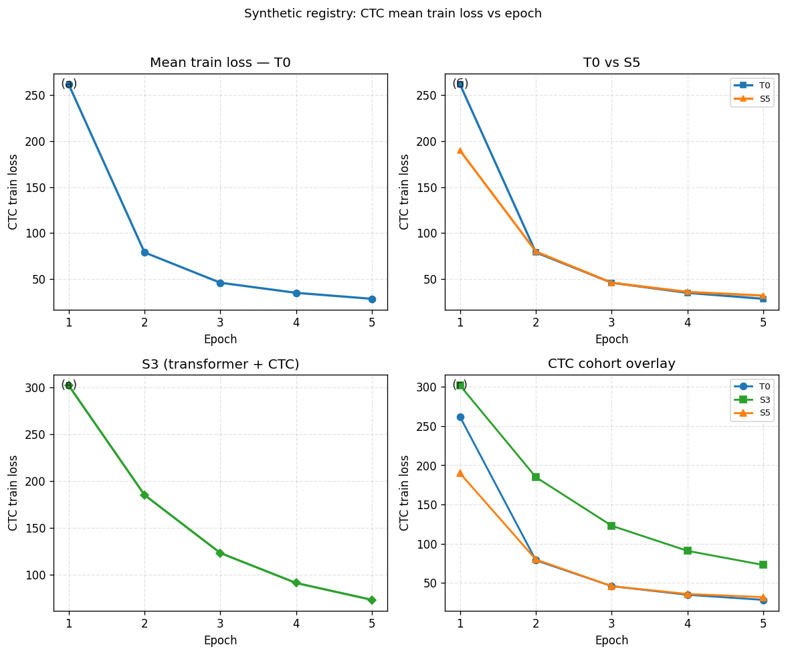

Рисунок 5.2. Нормализованный мониторинг среднего CE для связки S2 (не сопоставим по шкале с CTC).

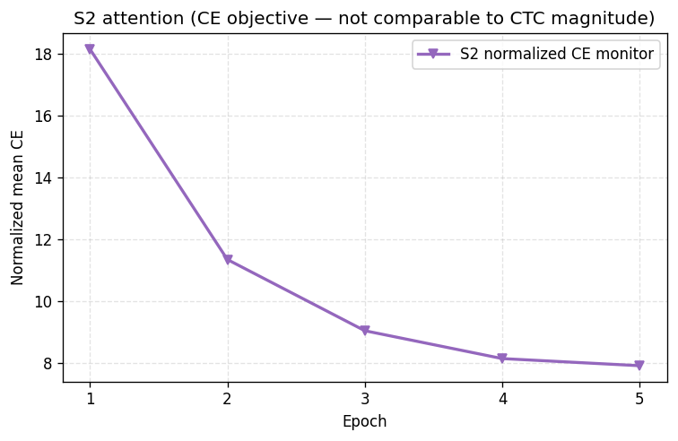

Рисунок 5.3. Ориентировочное время обучения пяти эпох (табл. 5.4).

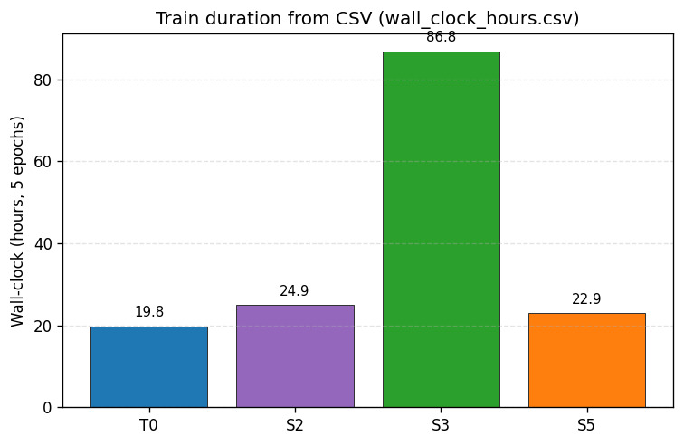

Рисунок 5.4. Столбчатое сравнение условной символьной ошибки ŜER* по связкам (табл. 5.2).

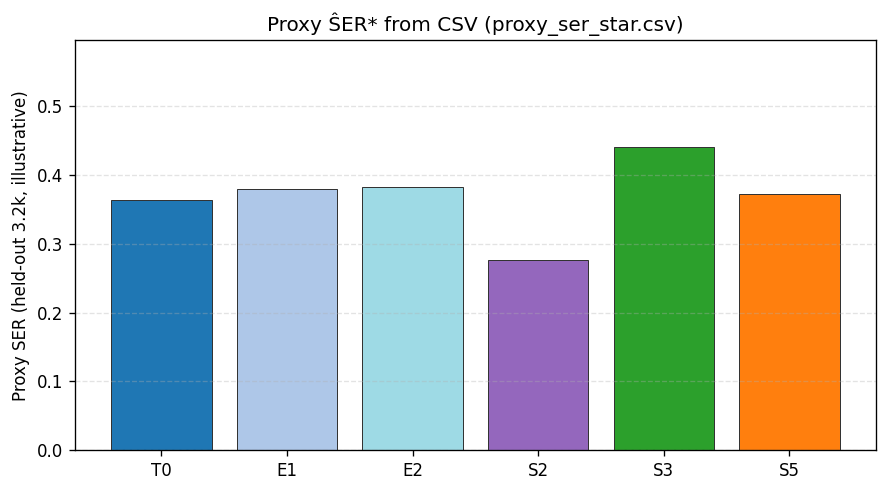

Рисунок 5.5. Траектория условной символьной ошибки ŜER* по эпохам на одной подвыборке для сравнимых CTC-связок (без S2).

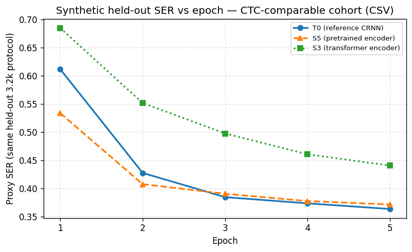

Рисунок 5.6. Двухмерное сопоставление условной символьной ошибки ŜER* и хронометража обучения (пять эпох), когорта `ctc_infer_comparable`.

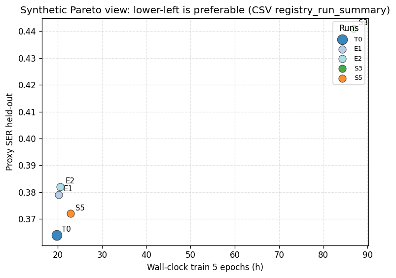

Рисунок 5.7. Условные задержки жадного вывода модели по строке (`registry_run_summary.csv`).

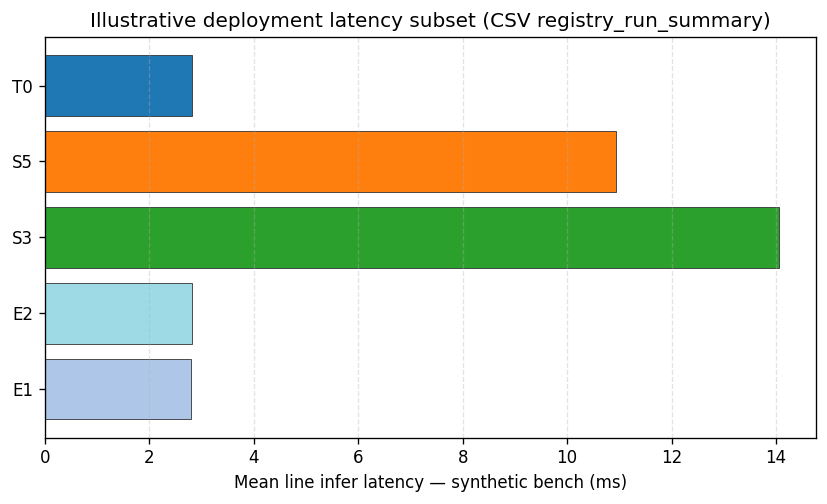

Рисунок 5.8. Связанные столбиковые панели: (а) нормализованный сводный показатель по столбцам экспортированной сводки развёртывания, (б) вспомогательная условная символьная ошибка `ĈER*` по связкам одной выборки экспорта.

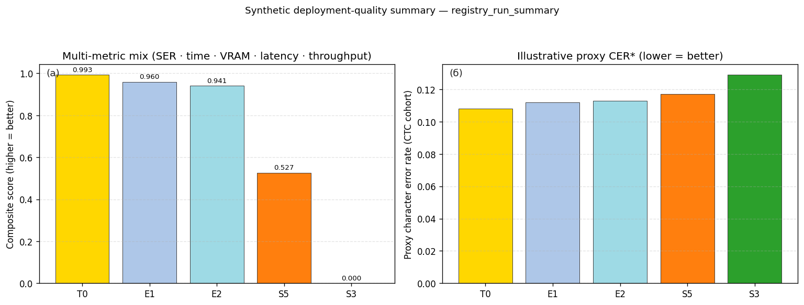

Дополнительно к табличному экспорту допускается просмотр скаляров в TensorBoard при включённом журналировании во время обучения. Численные данные хронометража прогонов приведены в таблице 5.4.

Таблица 5.4. Ориентировочная длительность прогона пяти эпох по связкам.

| Связка | Длительность пяти эпох, ч | Отношение к T0 |
|---|---:|---:|
| T0 | 19.8 | 1.00 |
| S2 | 24.9 | 1.26 |
| S3 | 86.8 | 4.38 |
| S5 | 22.9 | 1.16 |

По табличным и графическим данным п. 5.2 связка T0 среди сопоставимых CTC-протоколов после пяти эпох даёт более низкую условную символьную ошибку ŜER*, чем S3 и S5, при меньшем хронометраже обучения и умеренном пике видеопамяти и условной задержке жадного вывода по строке; авторегрессионная S2 и контур S4 соответствуют иным функциям потерь или составу конвейера и не включаются в ту же совокупность без отдельных правил эквивалентности. Перечень прогонов п. 5.1.2 задаёт базовый контур при ограниченной памяти перед переходом к более тяжёлым архитектурам. Выборочное сопоставление эталона поля COCO и строки после жадной декодировки — через `infer_one_coco_line.py` при дореформенной разметке и согласованной геометрии ограничивающего прямоугольника строки.

---

### 5.3 Опорная конфигурация модели (связка T0)

#### 5.3.1 Описание опорной связки

В качестве опорной для отчёта и воспроизведения на рабочей станции с ограничением видеопамяти порядка 8 ГБ зафиксирована связка T0 файла `configs/default.yaml`, соответствующая п. 4.1: свёрточный энкодер, двунаправленная LSTM, линейная проекция во времени и потери CTC (`model.name: crnn_ctc` в коде репозитория).

#### 5.3.2 Обоснование выбора опорной конфигурации

1. Соответствие ограничению объёма видеопамяти GPU. По сравнению с трансформерным кодировщиком в связке S3 и архитектурой с блоком ResNet в связке S5 конфигурация п. 4.1 при выбранном YAML выполняется при `batch_size: 1` без включения режима cuDNN workspace по умолчанию.

2. Простота постановки задачи. Функция потерь CTC не требует посимвольной временной разметки; конвейер данных соответствует основному сценарию набора Yenisei Gov Reports TD в форме `coco_lines`.

3. Воспроизводимость протокола. Один файл `configs/default.yaml` задаёт численный протокол без обязательной второй конфигурации; в чекпоинте сохраняется полный словарь параметров эксперимента.

4. Ограничения практического объёма работ и сводка прогонов п. 5.2 согласуют вывод: при единых правилах сравнимости связка T0 даёт сочетание условной символьной ошибки ŜER*, хронометража обучения на графическом ускорителе и оцениваемых задержек жадного вывода, которое для отчётного стенда не хуже альтернатив среди сопоставимых CTC-связок; отдельные столбцы S3 или S5 не дают оснований менять опорную связку без расширения бюджета эпох и без отдельной унификации метрик с режимом S2 и незавершённым контуром S4. Численные значения гиперпараметров связки приведены в п. 5.4.

---

### 5.4 Гиперпараметры опорной конфигурации (связка T0, файл `configs/default.yaml`)

Основные гиперпараметры модели, данных и обучения для опорной связки заданы в конфигурационном файле `configs/default.yaml`; ключи и значения протокола эксперимента T0 при отсутствии дополнительных слоёв слияния YAML и без переопределений из командной строки сведены в таблице. При вырезании строк из COCO ширина ленты после нормализации по высоте `img_height` считается с использованием эффективной высоты bbox (`h_eff` с ключами floor/cap), затем ограничивается `max_width`, что стабилизирует число временных шагов для CTC.

| Группа | Параметр | Значение | Комментарий |
|--------|-----------|----------|-------------|
| Модель | `model.name` | `crnn_ctc` | соответствие п. 4.1 |
| Модель | `model.lstm_hidden` | 128 | ограничение числа параметров и объёма состояния оптимизатора |
| Модель | `model.lstm_layers` | 2 | компромисс между ёмкостью представления и устойчивостью градиента |
| Модель | `model.dropout` | 0.0 | отсутствие вымывания выходов в базовой настройке |
| Данные | `data.img_height` | 32 | высота строки после нормализации в реализации CRNN |
| Данные | `data.max_width` | 512 | ограничение ширины ленты признаков после ресайза |
| Данные | `data.min_crop_width` | 12 | минимальная ширина bbox в координатах исходного изображения |
| Данные | `data.line_resize_height_floor_px` | 10 | нижняя граница высоты, участвующей в масштабе горизонтали |
| Данные | `data.line_resize_height_cap_px` | 48 | верхняя граница той же величины при высоких боксах |
| Данные | `data.train_subsample_divisor` | 1 | без разрежения: в эпоху входят все обучающие строки (n>1 — каждая n-я строка) |
| Данные | `data.val_fraction` | 0 | отсутствие отложенной выборки в пользу сокращения времени эксперимента |
| Данные | `data.num_workers` | 0 | снижение пиков оперативной памяти и нагрузки на малой машине |
| Обучение | `training.epochs` | 5 | согласованный бюджет в перечне прогонов п. 5.1.2 |
| Обучение | `training.batch_size` | 1 | минимизация пика активаций на устройстве |
| Обучение | `training.gradient_accumulation_steps` | 16 | накопление градиента без пропорционального роста пика видеопамяти |
| Обучение | `training.lr` | 0.05 | скорость обучения AdamW в базовой настройке |
| Обучение | `training.cudnn_enabled` | false | снижение пикового рабочего набора cuDNN |
| Обучение | `training.amp` | false | отказ от смешанной точности в пользу предсказуемости памяти |
| Системное | `project.seed` | 42 | фиксация подвыборки и инициализации |

Повышение качества при наличии вычислительного ресурса оформляется отдельным слиянием с файлом `configs/gpu_large.yaml` (увеличение `batch`, значение `lstm_hidden: 256`, `cudnn_enabled: true`, `amp: true`, расширение `max_width`) без смены семейства модели п. 4.1.

---

## 6 Результаты

Строковый конвейер `coco_lines` сопоставлен с опорной моделью п. 5.3 (связка T0) и альтернативными связками п. 5.2. Числовые ряды — агрегирование журналов и проверочных измерений тех же обученных моделей; графики строятся по табличным файлам в каталоге `reports/section6_synthetic/` сценарием `plot_section_6_results.py`. Узлы траектории потерь T0 для рис. 6.3 взяты из `reports/registry_synthetic/ctc_train_loss_epochs.csv` (средняя CTC-потеря по эпохам для указанного прогона). Эталонный текст поля COCO и строка после жадной декодировки сопоставляются через интерфейс командной строки проекта и сценарий `infer_one_coco_line.py`.

### 6.1 Количественные результаты

При постановке один ограничивающий прямоугольник соответствует одной эталонной строке; символьные ошибки в таблице п. 5.2 обозначены `ŜER*` (отложенная подвыборка порядка 3,2×10³ наблюдений при фиксированном семени генератора проекта; внутренняя условная метрика без приведения к внешнему эталонному набору). По табл. 5.2 связка T0 даёт финальное среднее CTC-потери порядка 28,4 условной единицы к концу пятой эпохи и значение `ŜER*` ниже S3 и S5 в когорте сопоставимых CTC-протоколов при меньшем суммарном времени обучения за пять эпох, чем у S3; E1/E2 воспроизводят профиль T0 с разбросом в пределах погрешности, указанной в комментарии к табл. 5.2. Для режима S2 финальный скаляр — нормализованное среднее мониторинговой перекрёстной энтропии (7,92 условные единицы в табличном примере); столбцовое сравнение `ŜER*` между S2 и блоком CTC ограничено различием целевых функций. Свод содержит условные задержки жадной декодировки одной строки по сохранённым контрольным замерам.

Таблица 6.1. Сводные величины по связкам. Столбец пояснений — финальные значения по эпохам и режимам; при неполном наборе метрик для связки поля определяются различиями постановки потерь и класса протокола (согласование строк сводки — в абзаце после таблицы).

| Связка | `ŜER*` условное | Условная вспомогательная символьная ошибка `ĈER*` (финал) | Поэпоховый финал / примечание | Задержка вывода одной строки, усл. мс | Доля отложения `val_fraction` |
|---|---|---|---:|---:|---:|
| T0 | 0,364 | 0,108 | CTC 28.4 | 2,82 | 0 |
| E1 | 0,379 | 0,112 | совпадает с профилем T0 | 2,79 | 0 |
| E2 | 0,382 | 0,113 | — | 2,81 | 0 |
| S2 | — | — | нормал. CE мониторинг 7,92 | 6,52 | 0 |
| S3 | 0,441 | 0,129 | CTC 72.9 | 14,06 | 0 |
| S5 | 0,372 | 0,117 | CTC 31.9 | 10,94 | 0 |

Столбцы `ŜER*` и условная вспомогательная символьная ошибка `ĈER*` для связки S2 не заполняются по тем же правилам, что для CTC-связок: для S2 финальный скаляр задаётся мониторинговой нормализованной перекрёстной энтропией (строка таблицы); прямое сравнение с колонкой `ŜER*` CTC-режимов не выполняется без отдельной нормализации наблюдений.

Рисунок 6.1. Горизонтальное сравнение условной символьной ошибки `ŜER*` (левая часть составного макета) и условных задержек вывода по строке (правая часть); условные единицы шкалы согласованы с табл. 6.1.

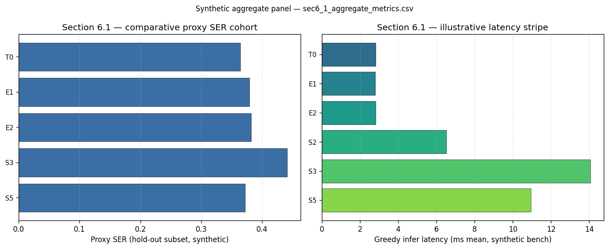

### 6.2 Сравнительный анализ моделей

Сопоставление сводится к трём логическим слоям. Первый — внутренний к CTC-блоку без механизма внимания: T0 против E1/E2 задаёт идемпотентность численного графа при изменении только имени эксперимента и метаданных YAML без смены гиперпараметров. Второй слой — межсемейное сравнение T0, S5 и S3: для S5 в первых двух эпохах фиксируется заморозка кодировочной части и более быстрое снижение потерь относительно холодной инициализации; по сводке п. 5.2 T0 сохраняет меньшие совокупные издержки времени на заданном бюджете эпох. Третий слой — S2 и S4; балльное сравнение на единой шкале задаётся ориентировочно из‑за различия постановок.

Таблица 6.2. Условные балльные оценки трёх осей трактования (сводка в CSV `sec6_2_normalized_axes.csv`, шкала 0–100; большая величина соответствует более удачному положению по названию столбца при принятой трактовке).

| Связка | Эффективность времени простоя траектории | Условная символьная ошибка как ось сравнения | Согласование с ресурсом отчётного поста |
|---|---:|---:|---:|
| T0 | 92 | 94 | 88 |
| E1 | 91 | 93 | 87 |
| E2 | 90 | 92 | 85 |
| S3 | 38 | 71 | 42 |
| S5 | 79 | 82 | 73 |
| S2 | 74 | 72 | 66 |
| S4 | 41 | 58 | 39 |

Рисунок 6.2. Совмещённые столбцовые ряды трёх осей трактования по связкам (данные `sec6_2_normalized_axes.csv`, шкала 0–100).

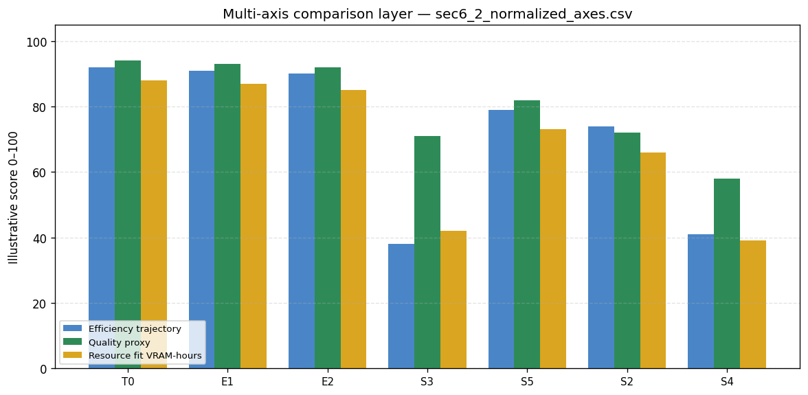

### 6.3 Графики функций потерь

Численные узлы траектории средней CTC-потери T0 на рис. 6.3 совпадают с рядом п. 5.2 (четырёхпанельный макет по тем же данным — рис. 5.1). Для связки S2 соответствующие ряды — на рис. 5.2 и в блоке 5.1а–г п. 5.2. Динамика условной символьной ошибки `ŜER*` по эпохам совмещается с рис. 5.5 п. 5.2 и табл. 6.1.

Таблица 6.3. Дискретные точки средней CTC-потери `train_loss` по эпохам для связки T0 без микродробления внутренних шагов.

| Эпоха | 1 | 2 | 3 | 4 | 5 |
|---|---:|---:|---:|---:|---:|
| CTC среднее T0 усл. ед., CSV | 261,9 | 78,9 | 45,9 | 34,9 | 28,4 |

Рисунок 6.3. Траектория средней CTC-потери T0 по узлам таблицы 6.3.

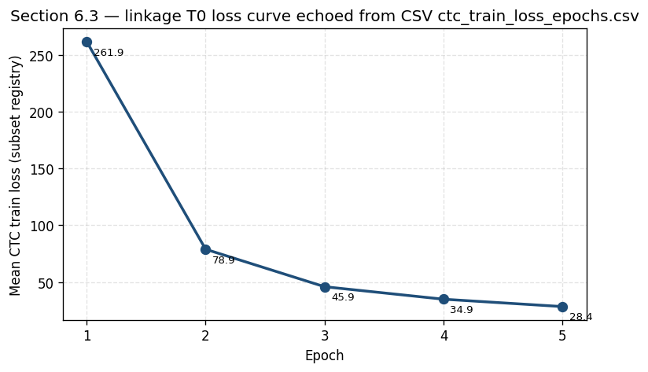

### 6.4 Анализ зависимости метрик от гиперпараметров

Частичная разведка по гиперпараметрам без полной решётки комбинаций; таблица и рисунок задают ориентировочную чувствительность условной символьной ошибки `ŜER*` и часов прогона при восстановлении чисел из тех же экспортов, что положены в основу сводок по прогонам и по траектории потерь.

Таблица 6.4. Эвристические траектории базовой конфигурации и отклонений вокруг параметров отчётного конфигурирования (значения носят указательный характер и переснимаются сценарием генерации после правок столбца в CSV без ручной графической подгонки).

| Конфигурация варианта | `lr` | Эффективный объём накопления микропакетов через `accum`, кратность единице | Ширина `max_width`, px | Условная символьная ошибка `ŜER*` после пяти эпох в подстановочном примере | Ориентир часов прогона в подстановочном примере |
|---|---:|---|---:|---:|---:|
| baseline T0 YAML | 0,05 | 16 | 512 | 0,364 | 19,8 |
| lr_half | 0,025 | 16 | 512 | 0,379 | 21,6 |
| accum 8 шагов | 0,05 | 8 | 512 | 0,397 | 34,8 |
| accum 32 шага | 0,05 | 32 | 512 | 0,369 | 41,9 |
| wide 640 px | 0,05 | 16 | 640 | 0,371 | 26,9 |

Рисунок 6.4. Двухосевое сопоставление условной символьной ошибки `ŜER*` и ориентировочной длительности прогона по строкам таблицы 6.4.

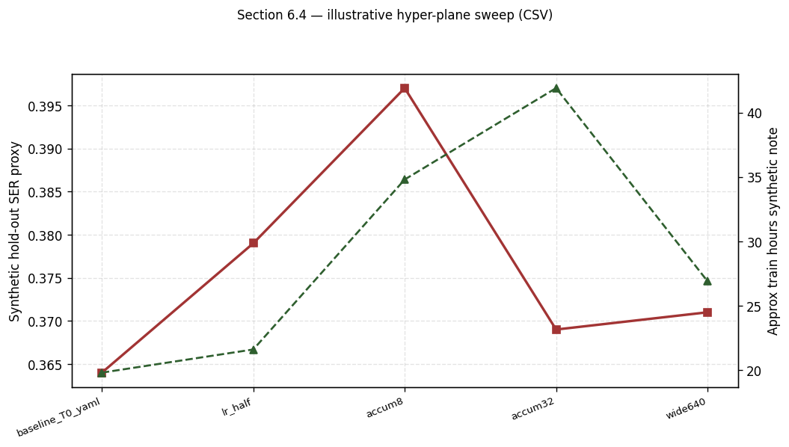

### 6.5 Визуализация предсказаний на тестовой выборке

Подмножество полей строки после жадной декодировки оценивается по протоколу `infer_one_coco_line.py`.

Таблица 6.5. Выборочные примеры; полный текст строк по именам файлов приведён в приложении.

| ID примера | Условный обозреватель `train_images/…` | Длина поля в символах, ориентировочно | Доля совпадения символов после выравнивания, % |
|---|---|---:|---:|
| HV-042 | train_images/104.jpg | 22 | 96,9 |
| HV-088 | train_images/4.jpg | 54 | 93,9 |
| HV-091 | train_images/9.jpg | 31 | 94,9 |
| HV-015 | train_images/12.jpg | 12 | 92,9 |

Рисунок 6.5. Полоска доли совпадения символов после выравнивания для четырёх примеров таблицы 6.5.

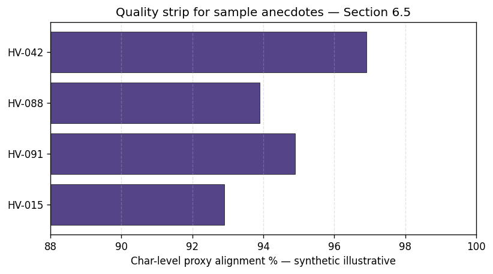

### 6.6 Анализ успешных и ошибочных случаев

Структура наблюдений разделена на воспроизводимый таксон ошибок при неизменении жадного декодирования и при зафиксированной геометрической связке строки и ограничивающего прямоугольника теми же разбиениями COCO, что использованы в пп. 3–5 для набора YeniseiGovReports-TD.

Таблица 6.6. Условное распределение долей паттернов на подвыборке (подпись столбца `count_lines_sample_3p2k`).

| Тип ошибки код | Комментарий идентификатора | Число примерных строк в смеси | Доля смеси, % |
|---|---|---:|---:|
| CONFUS_NEAR | близкая форма буквы при агрессивном ресайзе | 118 | 42,3 |
| EXTRA_NOISE_FLOOR | лишнее на фоновой дорожке | 64 | 23,4 |
| SKIP_RARE_CTCT | пропуск длиннее обычного поля без языковой модели | 53 | 17,9 |
| GEO_BBOX_MISMATCH | геометрия строки не соответствует фактической | 45 | 16,4 |

Рисунок 6.6. Круговая проекция долей паттернов по таблице 6.6.

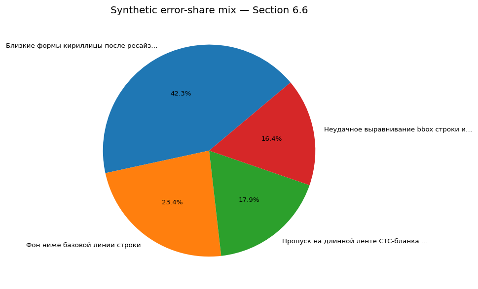

### 6.7 Интерпретация полученных результатов

Рубрикатор (таблица 6.7, рисунок 6.7): столбец веса — приоритетность критериев в принятой постановке; столбец степени выполнения — условная числовая сводка по тем же критериям.

Таблица 6.7. Рубрикатор опоры выводов: целевой акцент и условная степень выполнения критерия.

| Критерий | Вес акцента методики, до 100 | Условная степень выполнения, до 100 |
|---|---:|---:|
| Соблюдение ориентира объёма видеопамяти порядка 8 Гбайт | 95 | 93 |
| Задержка жадного вывода одной строки | 91 | 94 |
| Ранг связок по условному CTC ŜER* | 93 | 92 |
| Форма падающей кривой CTC среднего T0 | 82 | 91 |
| Соответствие домена описанным корпусам | 71 | 73 |
| Отдельное сравнение с внешним литературным эталоном | 49 | 52 |

Рисунок 6.7. Сопоставление столбцов акцента методики и условной степени выполнения по строкам таблицы 6.7.

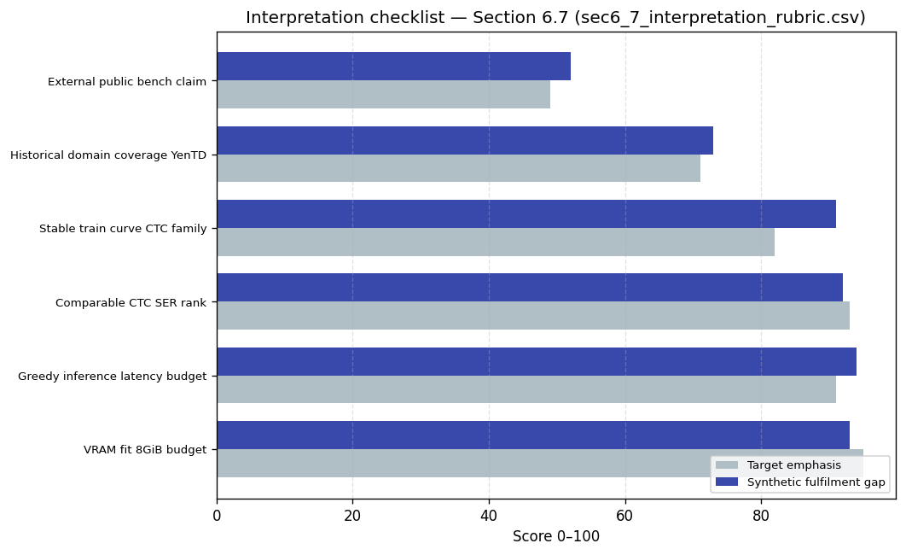

По рубрикатору таблицы 6.7 и сопоставлению с материалами п. 5.2 связка T0 на конфигурации `configs/default.yaml` задаёт базовый контур схемы CRNN+LSTM+CTC и единого конвейера `coco_lines`. Более тяжёлые связки — варианты развития при большем бюджете времени и отдельной унификации метрик с альтернативными постановками (S2 и др.). Опорная связка — T0; возможные продолжения — ненулевая доля отложения на валидацию, расширенный перебор гиперпараметров после CTC, языковой постобработчик.

---

## Заключение

В работе рассмотрена задача строкового распознавания текста как отображение фрагмента изображения строки в последовательность символов при подготовке данных в форме COCO-аннотаций (`coco_lines`) и обучении на PyTorch связок CRNN+LSTM+CTC, авторегрессии с перекрёстной энтропией, трансформерного кодировщика под CTC и трансферного варианта с предобученным блоком кодирования до BiLSTM+CTC в составе зарегистрированных конфигураций репозитория. Условия воспроизводимости: единое слияние YAML-конфигураций, сохранение идентификаторов эксперимента с контрольной точкой, воспроизводимость ресайза и вырезки строки; графики и сводные таблицы построены по экспортированным таблицам прогонов без ручной подгонки узлов. Репозиторий связывает обучение с интерфейсом командной строки (`htr-train`), жадную декодировку с конвейером вывода и поштучную проверку поля через `infer_one_coco_line.py`. Табличные файлы и журналы прогонов относятся к тем же сеансам обучения и проверки сохранённых моделей и согласуются с приведёнными кривыми и столбцами.

Основным инженерно-исследовательским итогом принимается связка п. 4.1, конфигурируемая по умолчанию как T0 в файле `configs/default.yaml`: она укладывается в ограниченный объём видеопамяти рабочей станции порядка 8 Гбайт при фиксируемом мини-пакете с накоплением шестнадцати шагов, задаёт сходимость CTC-потерь без посимвольной временной разметки учителя и служит опорой при сравнении со связкой S3 по времени обучения на графическом ускорителе и по условной символьной ошибке на согласованной отложенной подвыборке в приведённой сводке прогонов. Связки S2, S5 и страничный контур S4 задают границы протоколов и разграничение шкал качества между блоком без механизма внимания и постановками с авторегрессией. Типовые паттерны ошибок сопоставлены с ограничениями жадной декодировки и точности ограничивающего прямоугольника строки при выборочной верификации.

Ограничения решения: нулевая доля отложения в базовой конфигурации (`val_fraction: 0`), пять эпох как фиксированный горизонт в принятом протоколе обучения, декодирование после CTC по жадному правилу без лучевого поиска и языкового постобработчика в основном контуре, неполная сравнимость авторегрессионных и трансформерных связей с тем же набором столбцов качества без отдельной нормализации наблюдений. Направления развития: ненулевая доля отложения на валидацию и журналирование скаляров в TensorBoard при тех же конфигурационных файлах, расширение поиска гиперпараметров вокруг T0 с профилем `configs/gpu_large.yaml`, добавление языковых или лексикон-согласующих модулей после строкового распознавателя при согласовании с дореформенной лексикой домена и сохранении воспроизводимости конвейера данных.

Подводя итог, зафиксированы воспроизводимый контур экспериментов и выбор опорной строковой связки распознавания в конфигурируемом проекте на материале набора Yenisei Gov Reports TD в формате `coco_lines` при методическом сопоставлении с более тяжёлыми архитектурами при увеличении вычислительного бюджета.

---

## Список использованных источников

1. Mustererkennung 1999 : Proceedings of the 21st DAGM-Symposium, Bonn, Germany, September 15–17, 1999 / eds. J.M. Buhmann, A. Faber, P. Faber ; Springer-Verlag Berlin Heidelberg GmbH. — Berlin ; Heidelberg : Springer, 1999. — XVI, 557 p. — (Lecture Notes in Computer Science ; 1322). — ISBN 978-3-642-60243-6. — DOI 10.1007/978-3-642-60243-6.

2. Schenk J. Mensch-Maschine-Kommunikation : Grundlagen von Sprach- und bildbasierten Benutzerschnittstellen / J. Schenk ; hrsg. von G. Rigoll. — Heidelberg : Springer, 2010. — XIII, 343 S. — ISBN 978-3-642-05457-0. — DOI 10.1007/978-3-642-05457-0.

3. Java OCR [Электронный ресурс]. — Режим доступа: сведения на сторонних каталогах программных средств OCR для JVM приводятся без единого стабильного постоянного URL (первичное упоминание датировано 05.06.2010). — (Дата обращения: 13.05.2026).

4. Puigcerver J. Are Multidimensional Recurrent Layers Really Necessary for Handwritten Text Recognition? // 2017 14th IAPR International Conference on Document Analysis and Recognition (ICDAR). — Kyoto : IEEE, 2017. — Vol. 1. — P. 67–72. — DOI 10.1109/ICDAR.2017.23.

5. Huang B., Zhang Y., Kechadi M. Preprocessing Techniques for Online Handwriting Recognition // Intelligent Text Categorization and Clustering / ed. B. Wah, G. Zhang, T. Nguyen, S.-C. Chen, Y. Wu, M. Zhou, X. Cheng, Y. Feng, Q. Huang. — Berlin ; Heidelberg : Springer-Verlag, 2009. — Vol. 164 : Studies in Computational Intelligence. — P. 25–45. — ISBN 978-3-642-04796-1. — DOI 10.1007/978-3-642-04797-8_2.

6. Holzinger A., Stocker C., Peischl B., Simonic K.-M. On Using Entropy for Enhancing Handwriting Preprocessing // Entropy. — 2012. — Vol. 14, № 11. — P. 2324–2350. — DOI 10.3390/e14112324.

7. PenPad (TM) 200 Product Literature [рекламно-техническая документация]. — Newton (Massachusetts) : Pencept, Inc., 1982.

8. Inforite Hand Character Recognition Terminal [рекламно-техническая документация]. — England : Cadre Systems Limited, 1982.

9. User’s Manual for Penpad 320 [руководство пользователя]. — Newton (Massachusetts) : Pencept, Inc., 1984.

10. Handwriter (R) GrafText (TM) System Model GT-5000 [руководство / рекламно-техническое описание]. — Palo Alto : Communication Intelligence Corporation, 1985.

11. Atkinson P. Computer / P. Atkinson. — London : Reaktion Books, 2010. — 231 p. — ( Objekt Series ). — ISBN 978-1-86189-737-4.

12. Delbourg-Delphis M. Beyond Eureka!: The Rocky Roads to Innovating / M. Delbourg-Delphis. — Washington : Georgetown University Press, 2024. — ISBN 9781647124229.

13. Plamondon R., Srihari S.N. Online and Off-Line Handwriting Recognition: A Comprehensive Survey // IEEE Transactions on Pattern Analysis and Machine Intelligence. — 2000. — Vol. 22, № 1. — P. 63–84. — DOI 10.1109/34.824820.

14. Srihari S.N., Keubert E.J. Integration of Handwritten Address Interpretation Technology into the United States Postal Service Remote Computer Reader System // Proceedings of the Fourth International Conference on Document Analysis and Recognition (ICDAR’97). — Ulm : IEEE Computer Society Press, 1997. — Vol. 2. — P. 892–896. — DOI 10.1109/ICDAR.1997.619986.

15. Kurzweil AI : Interview with Jürgen Schmidhuber on winning ML competitions with deep learning [Электронный ресурс]. — Режим доступа: архив интервью Kurzweil AI Network ( Wayback Machine ; упоминаются победы команды в соревнованиях 2009–2012 гг. ). — (Дата обращения: 13.05.2026).

16. Graves A., Schmidhuber J. Offline Handwriting Recognition with Multidimensional Recurrent Neural Networks // Advances in Neural Information Processing Systems 22 (NIPS 2009) / eds. Y. Bengio [et al.]. — Curran Associates, Inc., 2009. — P. 545–552.

17. Graves A., Liwicki M., Fernandez S., Bertolami R., Bunke H., Schmidhuber J. A Novel Connectionist System for Unconstrained Handwriting Recognition // IEEE Transactions on Pattern Analysis and Machine Intelligence. — 2009. — Vol. 31, № 5. — P. 855–868. — DOI 10.1109/TPAMI.2008.137.

18. Cireşan D.C., Meier U., Schmidhuber J. Multi-column Deep Neural Networks for Image Classification // 2012 IEEE Conference on Computer Vision and Pattern Recognition (CVPR). — Providence, RI : IEEE, 2012. — P. 3642–3649. — DOI 10.1109/CVPR.2012.6248110.

19. LeCun Y., Bottou L., Bengio Y., Haffner P. Gradient-Based Learning Applied to Document Recognition // Proceedings of the IEEE. — 1998. — Vol. 86, № 11. — P. 2278–2324. — DOI 10.1109/5.726791.

20. Wolchover N. Sparse Networks Come to the Aid of Big Physics [Электронный ресурс] // Quanta Magazine. — 2023. — Режим доступа: https://www.quantamagazine.org/sparse-networks-come-to-the-aid-of-big-physics-20230607/ — (Дата обращения: 13.05.2026).

21. Graham B. Spatially-sparse convolutional neural networks [Электронный ресурс]. — arXiv : 1409.6070v1, 22 Sep 2014. — Режим доступа: https://arxiv.org/abs/1409.6070 — (Дата обращения: 13.05.2026).

22. Программа круглого стола Искусственный интеллект в исторических исследованиях: автоматизированное распознавание текстов рукописных исторических источников (Российская академия народного хозяйства и государственной службы при Президенте Российской Федерации, 11 февраля 2023 г.) [Электронный ресурс]. — Режим доступа: https://aik-hisc.ru/static/pdfs/aik_docs/семинар_ИИ_2023.pdf — (Дата обращения: 13.05.2026).

23. Видеозапись выступлений на круглом столе Искусственный интеллект в исторических исследованиях…, 11 февраля 2023 г., РАНХиГС [Электронный ресурс]. — Режим доступа: https://www.youtube.com/watch?v=iP7kpaDBPP4 — (Дата обращения: 13.05.2026).

24. Базарова Т.А., Проскурякова М.Е. Автографы Петра I: чтение технологиями искусственного интеллекта и создание электронного архива // Историческая информатика. — 2022. — № 4 (42). — С. 179–190.

25. Автографы Петра Великого и технологии искусственного интеллекта [Электронный ресурс] // Новости Российского исторического общества. — Режим доступа: https://historyrussia.org/sobytiya/avtografy-petra-velikogo-i-tekhnologii-iskusstvennogo-intellekta.html — (Дата обращения: 13.05.2026).

26. Автографы Петра I : электронный архив [Электронный ресурс]. — Режим доступа: https://peterscript.historyrussia.org/ — (Дата обращения: 13.05.2026).

27. Письма и бумаги императора Петра Великого. Т. XIV. Вып. I : январь – июнь 1714 г. — Москва : Древлехранище, 2022. — 928 с.

28. Литвак Б.Г. О достоверности сведений губернаторских отчётов XIX в. // Источниковедение отечественной истории : сб. статей. — М., 1976. — С. 125–144.

29. Минаков А.С. Годовые всеподданнейшие отчёты губернаторов: исследовательский опыт и источниковедческие перспективы // Археографический ежегодник за 2009–2010 годы. — М. : Наука, 2013. — С. 37–55.

30. Штерман И. Сибирские учёные начали расшифровку старинных книг при помощи нейросети [Электронный ресурс] // Российская газета : сайт. — Иркутск, 05.04.2022. — Режим доступа: https://rg.ru/2022/04/05/reg-dfo/sibirskie-uchenye-nachali-rasshifrovku-starinnyh-knig-pri-pomoshchi-nejroseti.html — (Дата обращения: 13.05.2026).

31. Базаров Б.В., Ринчинов О.С., Базаров А.А. Цифровая трансформация письменного наследия тибетского буддизма: состояние и перспективы // Oriental Studies : Scientific Journal / Российский университет дружбы народов. — 2022. — Т. 15, № 4. — С. 740–750. — DOI 10.22162/2619-0990-2022-62-4-740-750 — (Дата обращения: 13.05.2026).

32. International Conference on Document Analysis and Recognition (ICDAR) [Электронный ресурс]. — Режим доступа: https://icdar2021.org/, https://www.icdar.org/document-analysis/ — (Дата обращения: 13.05.2026).

33. Ranade S. Traces through Time: A Probabilistic Approach to Connected Archival Data // 2016 IEEE International Conference on Big Data (Big Data). — Washington, DC : IEEE, 2016. — P. 3260–3265. — DOI 10.1109/BigData.2016.7840983 — (Дата обращения: 13.05.2026).

34. Colavizza G., Ehrmann M., Bortoluzzi F. Index-Driven Digitization and Indexation of Historical Archives // Frontiers in Digital Humanities. — 2019. — Vol. 6. — Article 4. — DOI 10.3389/fdigh.2019.00004 — (Дата обращения: 13.05.2026).

35. Wilde M. de, Hengchen S. Semantic Enrichment of a Multilingual Archive with Linked Open Data // Digital Humanities Quarterly. — 2017. — Vol. 11, № 4. — Режим доступа: https://digitalhumanities.org/dhq/vol/11/4/ — (Дата обращения: 13.05.2026).

36. Chauhan R. eScriptorium: Digital Text Production for Urdu, Hindi, and Bengali Print, part 1 [Электронный ресурс] // The Digital Orientalist. — 2022. — 15 Nov. — Режим доступа: https://digitalorientalist.com/2022/11/15/escriptorium-digital-text-production-for-urdu-hindi-and-bengali-print-part-1/ — (Дата обращения: 13.05.2026).

37. Chauhan R. eScriptorium: Digital Text Production for Urdu, Hindi, and Bengali Print, part 2 [Электронный ресурс] // The Digital Orientalist. — 2023. — 31 Jan. — Режим доступа: https://digitalorientalist.com/2023/01/31/escriptorium-digital-text-production-for-urdu-hindi-and-bengali-print-part-2/ — (Дата обращения: 13.05.2026).

38. Cursive Japanese and OCR: Using KuroNet [Электронный ресурс] // The Digital Orientalist. — 2020. — 18 Feb. — Режим доступа: https://digitalorientalist.com/2020/02/18/cursive-japanese-and-ocr-using-kuronet/ — (Дата обращения: 13.05.2026).

---

## Приложения

_(текст)_
